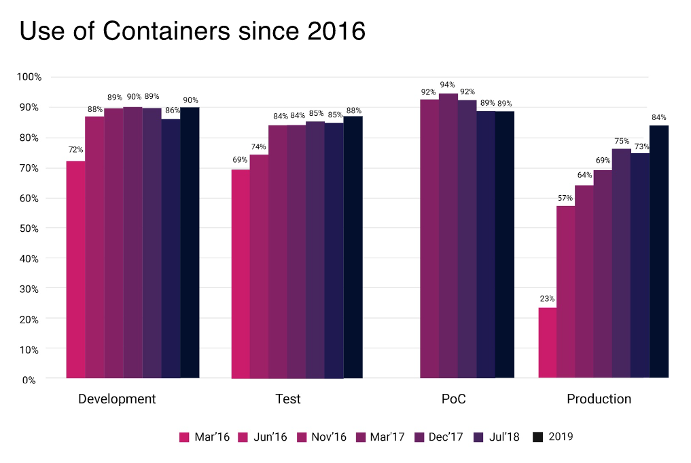

# 쿠버네티스란?

 

 

- 쿠버네티스는 컨테이너 오케스트레이션 중 하나
- 컨테이너화된 애플리케이션의 자동 디플로이, 스케일링 등을 제공하는 관리시스템
- 구글에 의해 설계, 현재 리눅스 재단에 의해 관리

 

## 참고 ⛔
해당 페이지는 쿠버네티스를 잘 설명해주는 44BITS라는 유튜브 채널의 [초보를 위한 쿠버네티스 안내서] 영상을 시청하고 이를 정리하였습니다.

 

## 1. 컨테이너 오케스트레이션 (Container Orchestration)
서버 관리 변화와 함께 알아보는 컨테이너 오케스트레이션

### 1) 문서화 📃
- .txt
- .ppt
- .pdf

### 2) 서버관리 도구 사용 🪛
- 기존에 직접 서버에 접속해서 명령어를 입력했다면 해당 도구를 이용하면 해당 도구가 명령어를 입력해줌
- 관리자는 도구에 맞게 프로그램을 설치하고 설정을 하면 됨
- 하지만 설정 도구를 공부해야 하며, 서버가 복잡해진다면 결국 관리가 힘들어 진다.
- 종류(예시)  
  - [Chef](https://docs.chef.io/platform_overview/)
  - [Puppet](https://puppet.com/docs/puppet/7/puppet_overview.html)
  - [Ansible](https://www.redhat.com/ko/technologies/management/ansible/what-is-ansible) 

### 3) 가상머신 💿
- 가상머신은 느리지만 관리도 직관적이지 않지만 괜찮음
- 하지만 클라우드 환경에 맞지 않음
- 특정 업체에 의존하게 됨.
- 멀티클라우드에 맞지 않음

### 4) docker 🐋
- 모든 실행 환경을 컨테이너로 구성
- 어떤 환경에서든 동작하기 쉬움
- 효율적으로 동작함
- 많은 서버관리자들의 복잡함을 해결해줌
- 컨테이너의 특징
  - 가상머신과 비교하여 컨테이너 생성이 쉽고 효율적
  - 컨테이너 이미지를 이용한 배포와 롤백 간단
  - 언어, 프레임워크에 상관없이 애플리케이션을 동일한 방식으로 관리
  - 개발, 테스팅, 운영 환경, 로컬, 클라우드에서 모두 동일한 환경을 구축할 수 있음
  - 특정 클라우드 업체에 종속적이지 않음
- 이러 장점 덕분에 점점 MySQL, redis, Jenkins 등 많은 소프트웨어를 컨테이너로 이용하게 됨
- docker를 이용한 개발 흐름 
  1) 코드작성
  2) docker 이미지 생성
  3) docker 이미지 저장
  4) docker 이미지 실행
- docker 이미지로 만들기만 하면 되기떄문에 서버 개발이 표준화가 됨
- 하지만 컨테이너가 매우 많아지면 각각의 컨테이너를 관리하는데 손이 많이 감
- 컨테이너의 개수가 많은 경우 생기는 문제점
  - 하나 하나 접속해서 실행해야하기 때문에 관리하기 어려움
  - 여유가 있는 서버가 무엇인지 모니터링하기 힘듬
  - 배포와 관련해서 롤아웃/롤백에 손이 많이 감
  - 마이크로서비스로 인해 내부 통신이 많아졌으며 이때 LoadBalancer 설치에 손이 많이감
  - 서비스 노출시 자동으로 설정이 안됨
  - 서비스 이상이나 부하 모니터링 불가

### 5) 컨테이너 오케스트레이션 🎻
- 복잡한 컨테이너 환경을 효과적으로 관리하기 위한 도구를 의미
- 서버관리자의 일을 대신 해주는 툴
- 특징 및 역핳
  1) 중앙제어 (master-node)
     - 컨테이너 오케스트레이션은 node를 cluster 단위로 추상화하여 관리함
     - 마스터 서버를 이용하여 다수의 cluster를 통제함
     - cluster 내부 node끼리 네트워크 통신이 잘 되도록 설정해줌
     - node의 개수가 매우 많더라도 문제 없이 돌아가도록 설정해줌
  2) 상태관리 
     - 관리자의 직접 조치 없이 알아서 상태를 유지해줌
  3) 배포 관리
     - 배포 시 서버를 자동으로 관리해줌
  4) 배포 버전관리
     - RollOut/RollBack를 중앙관리
  5) 서비스 등록 및 조회
     - 등록된 서버를 사용하는 PROXY는 자동으로 재설정해줌 
  6) 볼륨 스토리지
     - 다양한 노드 각각에 볼륨을 마운트해야 하는 경우 설정으로 관리할 수 있음
- 다양한 오케스트레이션 도구들의 탄생
  - [Deis](https://github.com/deis/deis)
  - [RANCHER](https://rancher.com/why-rancher)
  - [MESOS](https://mesos.apache.org/)
  - [Marathon](https://mesosphere.github.io/marathon/)
  - [Nomad](https://www.nomadproject.io/)
  - [docker Swarm](https://docs.docker.com/engine/swarm/)
- 이러한 오케스트레이션 춘추전국시대에 지금 표준이 된 "Kubernetes"가 등장 🌅

 

## 2. 왜 쿠버네티스(Kubernetes)를 많이 사용하는가?
- 컨테이너를 쉽고 빠르게 배포/확장하고 관리를 자동화하해주는 오픈소스 플랫폼
- 1주일에 20억개의 컨테이너를 생성하는 google이 컨테이너 배포 시스템으로 사용하던 borg를 기반으로 만든 오픈소스에서 시작 (2015년 release 됨)
- 현재는 Cloud Native Computing Foundation으로 소스기 이관되어 완전히 오픈소스가 됨

### 1) 특징
- 운영에서 사용가능한 컨테이너 오케스트레이션
- 행성 스케일 20억개보다만 적으면 사용가능
- 유연함
- 어디서든 동작 가능

### 2) 인기가 많은 이유
- 오픈소스
  - [kubernetes github](https://github.com/kubernetes/kubernetes)
  - Google, Red Hat, VMware, Microsoft, Intel 등 다양한 기업에서 참여
  - 커뮤니티가 매우 활발히 활동 중(150개 이상의 모임, 컨퍼런스 문화도 잘 발달되어 있음)
- 엄청난 인기
  - CNCF 설문조사에서 운영에 사용되는 부분이 84%
  
  
  - CNCF 설문조사에서 도입해서 사용하는 비율이 압도적으로 높음
  

  - 국내 KAKAO, LINE 등에서도 구축하여 사용
  
- 무한한 확장성
  - 다음과 같은 플랫폼이 쿠버네티스위에서 동작한다
    - [Kubeflow](https://www.kubeflow.org/)
    - [TEKTON](https://tekton.dev/)
    - [Istio](https://istio.io/)
    - [Knative](https://knative.dev/docs/)
  - 이에 따라 기존에 개발자에게 정말 중요했던 리눅스의 중요도가 내려감 
- 사실상 표준
  - 이제 쿠버네티스가 컨테이너오케스르테리이션의 [De facto(사실상)](https://ko.wikipedia.org/wiki/%EB%8D%B0_%ED%8C%8D%ED%86%A0)
  - 다양한 컨테이너 기반 소프트웨어 관리에 사용되는 제품도 쿠버네티스를 사용한다.
    - [Rancher (by SUSE)](https://rancher.com/) : 기존에는 오케스트레이션을 직접 구현했으나 이제는 쿠버네티스 위에서 커스터마이징 하여 사용
    - [Red Hat OpenShift (by IBM)](https://docs.openshift.com/)
    - [Tenzu (by VMware)](https://tanzu.vmware.com/tanzu)
  - Docker에서도 지원
  - 클라우드 서비스에서도 쿠버네티스를 managed service로 제공
    - [EKS (Amazon - Elastic Kubernetes Service)](https://aws.amazon.com/ko/eks/)
    - [AKS (Azure Kubernetes Service)](https://github.com/Azure/AKS)
    - [GKE (Google Kubernetes Engine)](https://cloud.google.com/kubernetes-engine)

- CNCF : CLOUD NATIVE COMPUTING FOUNDATION
  - 클라우드 환경에 적합한 컴퓨팅 기술을 지원하는 오픈소스 단체
  - The Linux Foundation의 소속 단체
  - 클라우드 환경에 적합한 기술들을 호스팅
  - CNCF Trail Map의 핵심에 Kubernetes가 있다
    
    - 컨테이너
    - CI/CD
    - 오케스트레이션
    - 모니터링
    - 서비스 디스커버리
    - 네트워크 & 보안
    - 분산 DB & 저장소
    - 메시징
    - 컨테이너 런티임
    - 베포 (인증)
  - 한마디로 말하면 쿠버네티스는 컨테이너 오케스트레이션의 사실상의 표준이며 Cloud Native의 핵심 역할이다

### 3) 학습관련
- Docker를 모르면 쿠버네티스를 이해하기 어려우므로 Docker를 공부해야한다.

 

## 3. 쿠버네티스 소개

### 1) 쿠버네티스 정리
- 쿠버네티스는 컨테이너화된 애플리케이션을 자동으로 배포하고, 스케일링하며 관리한다.
- 쿠버네티스는 컨테이너를 쉽게 관리하고 연결하기 위해 논리적인 단위로 그룹화했다.
- 구글에서 15년간 경험을 토대로 최상의 아이디어와 방법들을 결합했다. 구글은 컨테이너를 계속 사용했으며 쿠버네티스 이전에 borg라는 이름으로 내부 프로젝트를 진행했으며 borg가 발전한 것이 쿠버네티스이다.
- 구글 외에도 다양한 기업에서 참여하여 발전되고 있으며 각 기업들의 노하우가 쌓여있다.
- 정리
  - 컨테이너 관리를 자동화
  - 논리적인 단위를 추상화 하여 관리
  - 다양한 노하우가 담겨있음
  - 
## 2) Cloud Native란?
- Cloud Native를 이해하면 쿠버네티스를 이해하는데 큰 도움이 된다.
- 클라우드 전/후
  - 클라우드 이전 : 리소스를 직접 하나 하나 관리
  - 클라우드 이후 : 수 많은 리소스를 자유롭게 사용하고 추상적으로 관리
- 이러한 클라우드 환경에서 어떻게 애플리케이션을 배포하는것이 좋을까?
  - 컨테이너화 해서 배포?
  - 서비스메시 사용?
  - 마이크로서비스로 나눌까?
  - API 많이 활용할까? 
  - 인프라 쓰고 버릴까?
  - DevOps 적용?
- 쿠버네티스 위에서는 이러한 개념을 구현하기 매우 쉽다.
- 따라서 쿠버네티스는 새로운 배포 시스템이 아니라 클라우드에 맞는 베포 시스템이라고 생각하면 좋다.
