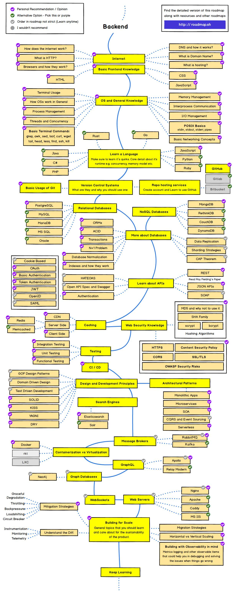

# CS 공부를 위한 자료 정리

## Backend Roadmap
  

## 조사한 사이트 목록

#### 👉 개발자 로드맵 2022
https://github.com/kamranahmedse/developer-roadmap  
: 개발자를 위한 로드맵을 정리해 놓은 사이트

 

#### 👉 신입 개발자 전공 지식 & 기술 면접 백과사전
https://gyoogle.dev/blog/  
: 과목별 기본 개념과 면접 질문과 답을 정리해 놓은 사이트
- 알고리즘
- CS
- 디자인 패턴
- 언어
- Web
- 면접 질문 & 답
- 리눅스
- 깃허브

 

#### 👉 주니어 개발자를 위한 취업 정보
https://github.com/jojoldu/junior-recruit-scheduler   
: 취업 정보와 팁, 후기를 정리해 놓은 깃허브
- 채용 정보
- 구직 팁 (코테 문제해설, 이력서 작성법, 구직 후기)

 

#### 👉 기술 면접 대비를 위한 기본 개념을 정리
https://github.com/WeareSoft/tech-interview  
: CS 과목들의 기본 개념을 정리해 놓은 깃허브
- 자료구조
- 네트워크
- 운영체제
- 데이터베이스
- 디자인 패턴
- 알고리즘
- Java
- JavaScript
- Spring
- 보안

 

#### 👉 신입 개발자들이 갖춰야할 능력 (책과 강의 추천)
https://youngban.tistory.com/5  
: 과목별 필수 학습내용 및 책과 강의를 추천해주는 블로그
- 컴퓨터구조 (★★★★★)
- 운영체제 (★★★★★)
- 컴퓨터 네트워크 (★★★★★) 
- C
- 객체지향 개발언어(자바/C++ 등)
- 자료구조
- 알고리즘
- 소프트웨어 공학
- 스크립트 개발언어(Javascript/Python 등)
- 웹 프로그래밍(php/asp.net/spring 등)
- 수학

 

#### 👉 신입 개발자 기술 면접 준비
https://cocoon1787.tistory.com/668   
: 기술 면접 준비를 위한 CS지식들의 링크를 정리해놓은 블로그  
- 개발 상식
- 알고리즘
- 자료구조
- 네트워크
- 운영체제
- 데이터베이스

 

#### 👉 네이버 D2 - 백엔드 개발자를 꿈꾸는 학생개발자에게
https://d2.naver.com/news/3435170  
: 네이버 D2에서 미래의 백엔드 개발자를 꿈꾸는 학생개발자들이 네이버의 백엔드 개발자에게 궁금한 내용을 묻고, 답한 내용을 정리한 글
- 백엔드 개발자의 진로
  - 일의 범위
  - 보람과 고충
  - 향후 전망
  - 다른 분야로의 확장
  - 🌟 백엔드 개발에 필요한 지식 🌟
  - 데이터베이스
  - 개발툴
  - 병렬처리
  - 보안
  - 테스트
  - 자료구조/알고리즘
  - 개발 프레임워크
  - Serverless
- 실무에서 하는 고민
  - 용어의 범위
  - 클라이언트와 백엔드의 역할분담
  - 클라이언트를 위한 API 설계
  - 시스템을 어떻게 자를것인가
- 네이버의 백엔드 개발
  - 개발,배포 방식
  - 인프라 기술 활용

 

#### 👉 어떻게 네트워크를 공부할 것인가?(네트워크 공부 방법에 대하여)
https://covenant.tistory.com/222  
: 네트워크 과목을 공부하는데 필요한 강의와 도서를 정리해 놓은 블로그
- 강의
- 도서 (입문 -> 중급 -> 심화 -> 활용)

 

#### 👉 cs 과목 길잡이
https://velog.io/@1w2k/cs-%EA%B3%BC%EB%AA%A9-%EA%B8%B8%EC%9E%A1%EC%9D%B4  
: cs 과목을 어떻게 공부하고 시작할지를 도와주는 블로그
- 블로그 보는 법
- 시작하기에 앞서...
- 프로그래밍 언어
- 네트워크
- 운영체제
- 데이터베이스
- 코딩테스트
- 딥러닝(참고)

 

#### 👉 컴퓨터과학 스스로 학습하기
https://github.com/minnsane/TeachYourselfCS-KR/blob/main/README.md  
: CS를 스스로 학습하기 위해 무엇을 공부하고 어떤 강의나 어떤 도서를 참고할지를 도와주는 깃허브 (영문 강의)

- 요약 :  
    독학 엔지니어나 부트캠프 졸업생이라면, 컴퓨터 과학을 배우는 것도 놓쳐서는 안됩니다. 다행스럽게도, 시간이나 학위를 위한 학자금 투자 없이 월드클래스 컴퓨터과학(Computer Science, 이하 CS) 교육을 받을 수 있습니다. 세상엔 수많은 리소스가 있지만, 어떤 것들은 다른 것들보다 더 뛰어납니다. 당신에겐 '200개가 넘는 무료 온라인 코스' 같은 리스트는 필요 없습니다. 다음 질문에 답만 있으면 됩니다:
  - 어떤 과목을 배워야 하며, 왜 배워야 하는가?
  - 각 과목 최고의 책 또는 영상 강의는 무엇인가?

 

#### 👉 나의 온라인 컴퓨터공학 공부
https://coding-groot.tistory.com/93  
: 컴퓨터 공학 학생이 CS 관련 사이트를 정리해 놓은 블로그 
- 온라인 커리큘럼
- 강의와 도서
- 무료로 배울 수 있는 국내 강의 사이트 모음
- 수학 공부
- 학교에서는 안 가르쳐 주지만 새내기 때 알았으면... 했던 것들
- 해외 무크 강의
- 머신러닝 / 딥러닝
- 공개된 전자책 모음
- 컴퓨터공학 관련 동영상 모음
- 깃허브 멋쟁이 시리즈들 (😎Awesome Repositories)
- 개발용으로 사용 가능한 콘텐츠들
- GitHub Student Developer Pack

 

#### 👉 SW 직군 면접 사이트, 주니어 공부 방법 사이트
https://garden1500.tistory.com/2  
: 각종 공부 사이트를 정리해 놓은 블로그
