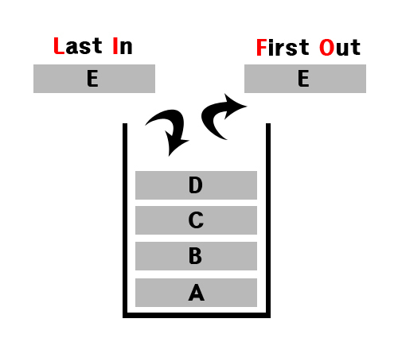
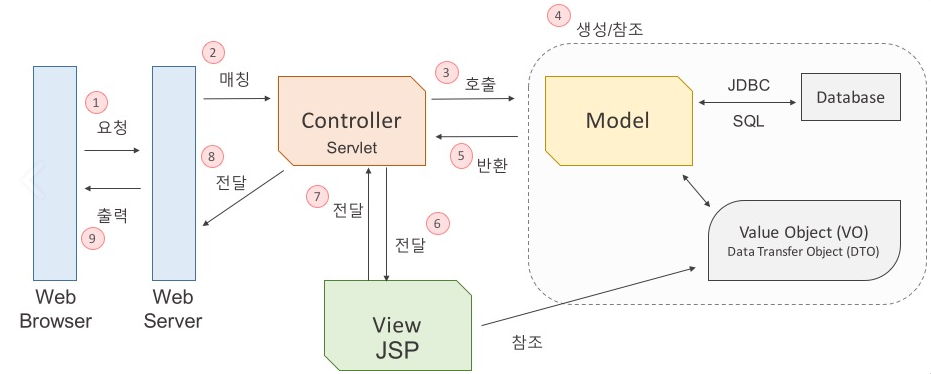
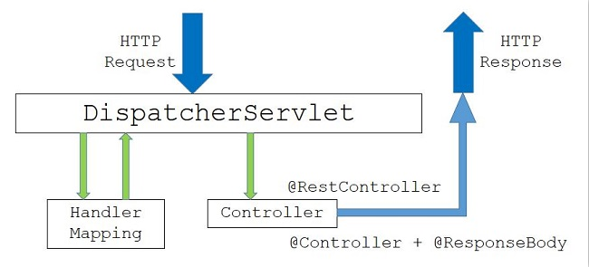
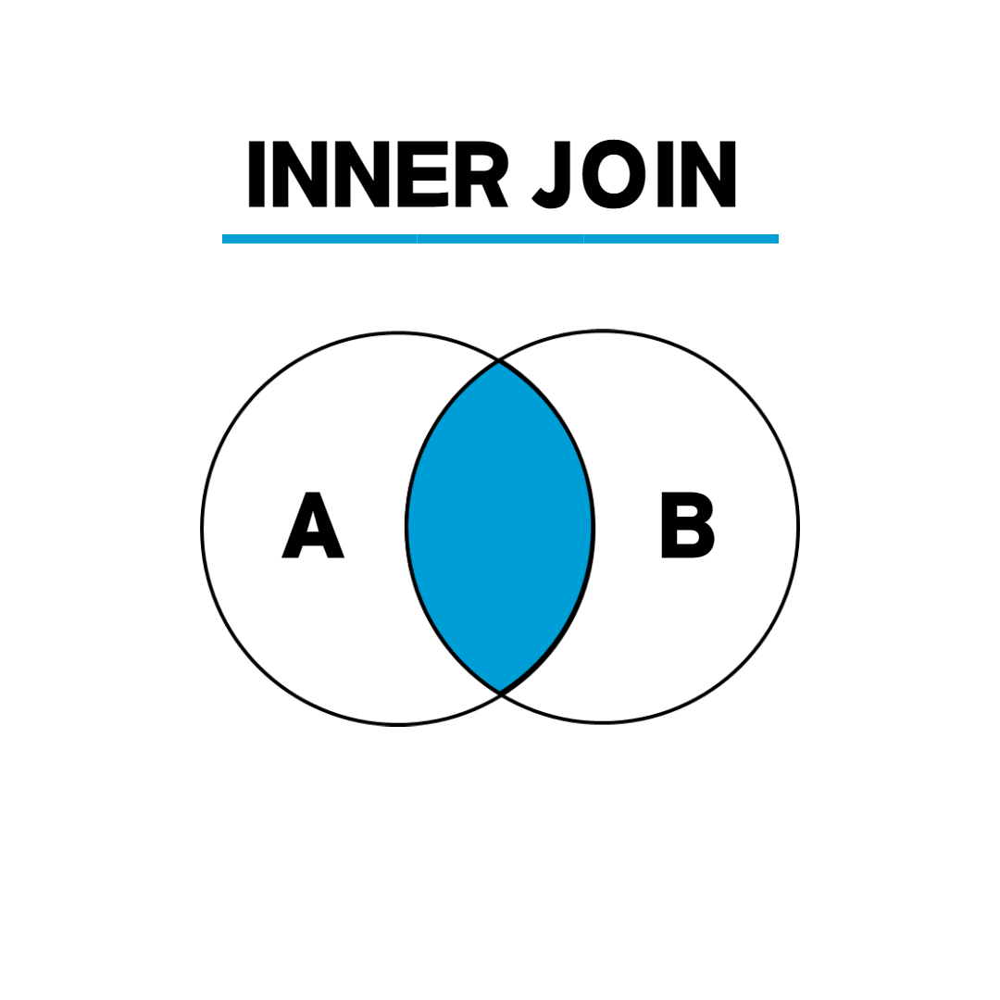
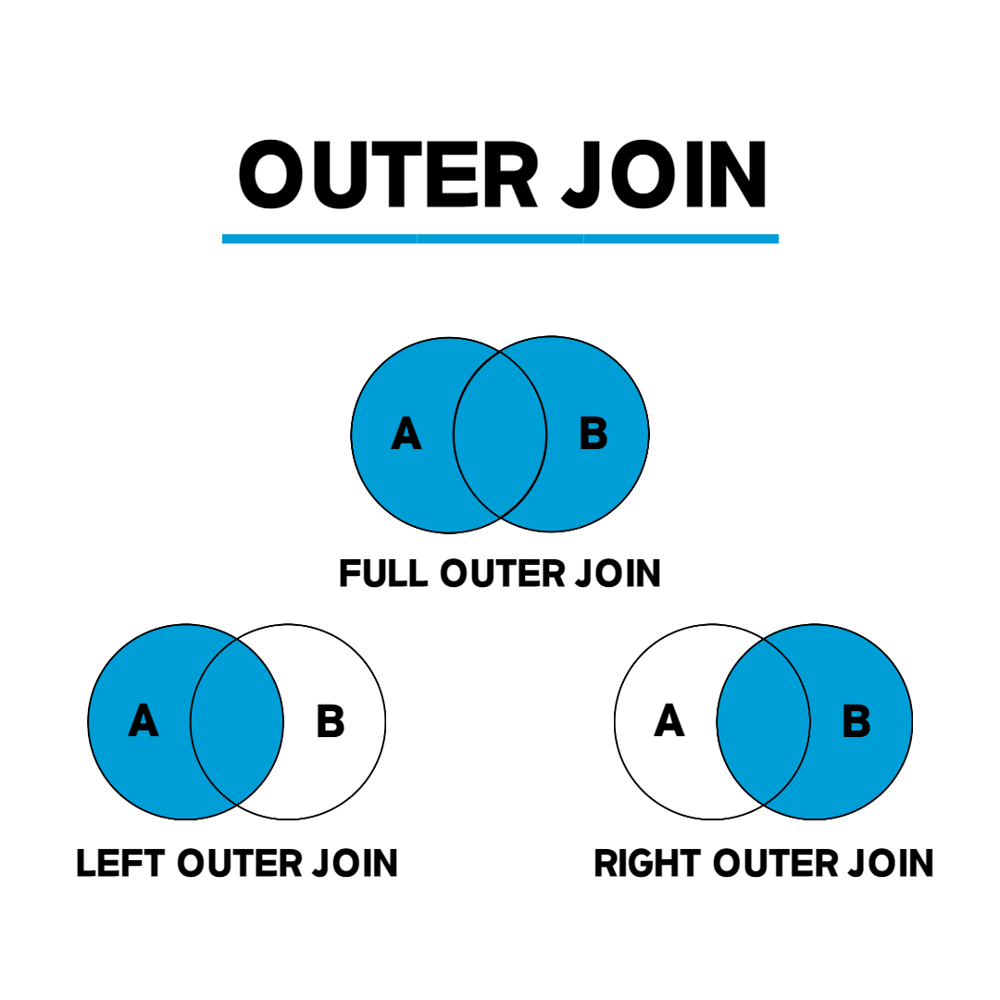
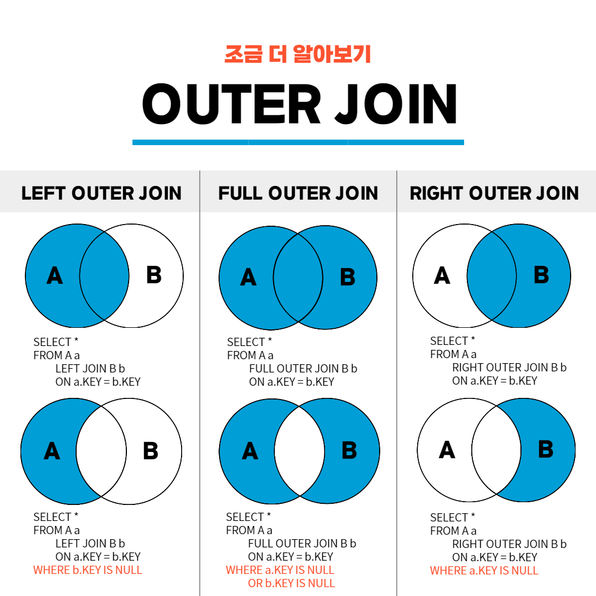
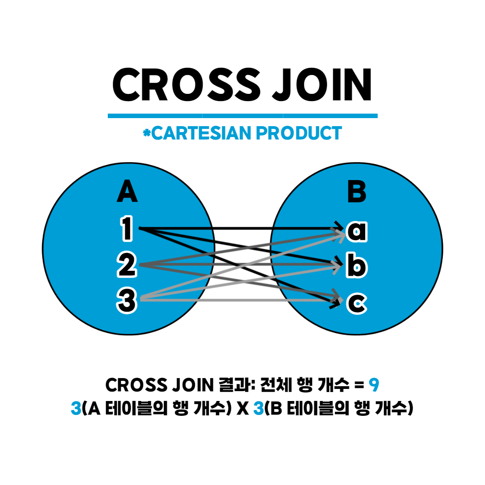
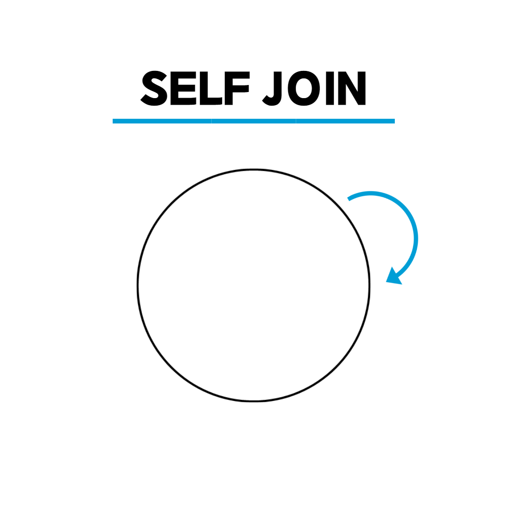

# Tech-Interview
빅데이터 엔지니어로 취업을 준비하며 기술 면접을 위한 CS 지식 정리

## 목차
- [1. 스택과 큐](#1-스택과-큐)
- [2. Deque](#2-deque)
- [3. 자료형 종류](#3-자료형-종류)
- [4. 함수의 종류](#4-함수의-종류)
- [5. 함수와 메소드](#5-함수와-메소드)
- [6. MVC 패턴](#6-mvc-패턴)
- [7. Spring MVC](#7-spring-mvc)
- [8. 디자인 패턴](#8-디자인-패턴)
- [9. API](#9-api)
- [10. SQL - JOIN](#10-sql---join의-종류)
- [11. SQL - 서브쿼리](#11-sql---서브쿼리)

<br/>

## 1. 스택과 큐

#### 스택(Stack)
- 영어로 Stack '쌓다' 라는 의미.
- 프로그래밍에서 목록 혹은 리스트에서 접근이 한쪽에서만 가능한 구조.
- LIFO(Last-In, First-Out)가 기본원리.
    
- 대표적인 내장함수
	- push
	- peek
	- pop

<br/>

#### 큐(Queue)
- 영어로 Queue '일이 처리되기를 기다리는 리스트' 라는 의미.
- 프로그래밍에서 목록 혹은 리스트에서 접근이 양쪽에서 가능한 구조.
- FIFO(First-In, First-Out)가 기본원리.
    
- 대표적인 내장함수
	- put
	- peek
	- get

<br/>


## 2. Deque
- deque는 stack과 queue의 기능을 모두 가진 객체.
- 양방향 queue.
- 앞, 뒤 양쪽 방향에서 요소를 추가 제거할 수 있음.
- 대표적인 내장 함수
    - deque.append(item): item을 데크의 오른쪽 끝에 삽입.
    - deque.appendleft(item): item을 데크의 왼쪽 끝에 삽입.
    - deque.pop(): 데크의 오른쪽 끝 엘리먼트를 가져오는 동시에 데크에서 삭제.
    - deque.popleft(): 데크의 왼쪽 끝 엘리먼트를 가져오는 동시에 데크에서 삭제.
    - deque.extend(array): 주어진 배열(array)을 순환하면서 데크의 오른쪽에 추가.
    - deque.extendleft(array): 주어진 배열(array)을 순환하면서 데크의 왼쪽에 추가.
    - deque.remove(item): item을 데크에서 찾아 삭제.
    - deque.rotate(num): 데크를 num만큼 회전(양수면 오른쪽, 음수면 왼쪽).

<br/>


## 3. 자료형 종류

#### 기본 자료형
- 숫자형
    - int (정수형)
    - float (실수형)
    - complex (복소수형)
- 논리형
    - bool (True / False)

<br/>

#### 군집 자료형
- 시퀀스(Sequence) 형태 : 순서가 중요
    - str (문자열) : 문자열을 위한 list와 같은 객체 자료형 (순서O, 중복O, 수정X)
    - list (리스트) : 순서가 있는 값의 나열 (순서O, 중복O, 수정O)
    - tuple (튜플) : list와 유사, 읽기 전용 (순서O, 중복O, 수정X)
- 비 시퀀스(Non Sequence) 형태 : 순서가 중요하지 않음
    - set (집합) : 순서가 없고, 중복을 허용하지 않는 값들의 모임 (순서X, 중복X, 수정O)
    - dict (사전) : 순서가 없고, 반드시 키를 사용하여 원소에 접근 (순서X, 중복X, 수정O)

<br/>

#### 군집 자료형 비교
||List|Tuple|Set|Dictionary|
|---|---|---|---|---|
|순서 유무|O|O|X|X|
|중복 허용|O|O|X|X|
|수정 가능|O|X|O|O|
|예시|[1, 2, 3]|(1, 2, 3)|{1, 2, 3}|{'a' : 1, 'b' : 2, 'c' : 3}|
|주요 특징|index를 지정하여 값 변경 가능|수정이 불가능하지만 속도가 빠름|List의 중복값 삭제용으로 주로 사용|Key와 Value로 구성|

<br/>

## 4. 함수의 종류

#### 내장함수
- 파이썬 인터프리터에서 기본적으로 포함하고 있는 함수.
- import를 필요로 하지 않음.
- 내장함수 목록
    - abs(), all(), any(), ascii()
    - bin(), bool(), breakpoint(), bytearray(), bytes()
    - callable(), chr(), classmethod(), compile(), complex()
    - delattr(), dict(), dir(), divmod()
    - enumerate(), eval(), exec()
    - filter(), float(), format(), frozenset()
    - getattr(), globals(), hasattr(), hash(), help(), hex()
    - id(), input(), int(), isinstance(), issubclass(), iter()
    - len(), list(), locals()
    - memoryview(), min(), map(), max(), next()
    - object(), oct(), open(), ord()
    - pow(), print(), property()
    - range(), repr(), reversed(), round()
    - set(), setattr(), slice(), sorted(), staticmethod(), str(), sum(), super()
    - tuple(), type()
    - vars()
    - zip()
    - __import__()

<br/>

#### 외장함수
- import 문을 사용하여 외부의 라이브러리에서 제공하는 함수.
- 파이썬 기본 라이브러리들은 파이썬 설치 시 자동으로 설치.
- 기본 라이브러리 목록
    - Sys : 파이썬 인터프리터가 제공하는 변수들과 함수들을 직접 제어할 수 있게 해주는 모듈.
    - Pickle : 객체의 형태를 그대로 유지하면서 파일에 저장하고 불러올 수 있게 하는 모듈.
    - Os : 환경 변수나 디렉터리, 파일 등의 OS 자원을 제어할 수 있게 해주는 모듈.
    - Shutil : 파일을 복사해 주는 파이썬 모듈.
    - Glob: 특정 디렉터리에 있는 파일 이름 모두를 알아야 할 때 사용하는 모듈. 디렉터리 내의 파일들을 읽어서 리스트로 리턴.
    - Tempfile: 파일을 임시로 만들어서 사용할 때 유용한 모듈.
    - Time: 시간과 관련 모듈.
    - Calendar: 파이썬에서 달력을 볼 수 있게 해주는 모듈.
    - Random: 난수(규칙이 없는 임의의 수)를 발생시키는 모듈.
    - Webbrowser: 자신의 시스템에서 사용하는 기본 웹 브라우저가 자동으로 실행되게 하는 모듈.

<br/>

#### 사용자 정의함수
- def 문을 사용해서 사용자가 직접 정의하는 함수.


<br/>

## 5. 함수와 메소드
- 함수
    - 함수 이름을 통해 사용.
    - 독립적으로 사용 가능.
    - ex) print(), str()
    
- 메소드
    - 클래스 내에 선언되어 있는 함수.
    - 객체와 연관되어 사용.
    - ex) .split(), .append()

- 함수는 독립적으로 정의 되어 있어 이름만으로도 호출 가능 하지만 메소드는 클래스를 호출해야 사용가능. 
- 메소드는 클래스에 종속.
- 함수가 메소드보다 포괄적인 의미.


## 6. MVC 패턴


- 모델-뷰-컨트롤러(model–view–controller, MVC)는 소프트웨어 공학에서 사용되는 소프트웨어 디자인 패턴.
- 사용자 인터페이스로부터 비즈니스 로직을 분리하여 애플리케이션의 시각적 요소나 그 이면에서 실행되는 비즈니스 로직을 서로 영향 없이 쉽게 고칠 수 있는 애플리케이션을 만들 수 있음.
- MVC에서 모델은 애플리케이션의 정보(데이터)를 나타내며, 뷰는 텍스트, 체크박스 항목 등과 같은 사용자 인터페이스 요소를 나타내고, 컨트롤러는 데이터와 비즈니스 로직 사이의 상호동작을 관리.

<br/>

#### Model
- Model은 Data와 애플리케이션이 무엇을 할 것인지를 정의하는 부분으로 내부 비즈니스 로직을 처리하기 위한 역할.
- 모델은 컨트롤러가 호출을 하면 DB와 연동하여 사용자의 입출력 데이터를 다루는 일과 같은 데이터와 연관된 비즈니스 로직을 처리하는 역할.
- 데이터 추출, 저장, 삭제, 업데이트 등의 역할을 수행.
- 규칙
    - 사용자가 편집하기를 원하는 모든 데이터를 가지고 있어야 함.
    - View나 Controller에 대헤서 어떤 정보도 알지 말아야 함.
    - 변경이 일어나면, 변경 통지에 대한 처리방법을 구현해야만 함.

<br/>

#### View
- View는 사용자에게 보여주는 화면(UI)에 해당됨.
- 사용자와 상호작용을 하며 컨트롤러로부터 받은 모델의 결과값을 사용자에게 화면으로 출력하는 일을 함.
- MVC에서는 여러개의 View가 존재할 수 있음.
- Model에서 받은 데이터는 별도로 저장하지 않음.
- 규칙
    - Model이 가지고 있는 정보를 따로 저장해서는 안됨.
    - Model이나 Controller와 같이 다른 구성요소들을 몰라야 함.
    - 변경이 일어나면 변경 통지에 대한 처리방법을 구현해야만 함.
    - Model과 View는 서로의 존재를 몰라야 함.

<br/>

#### Controller
- Controller는 Model과 View 사이를 이어주는 인터페이스 역할.
- Model이 데이터를 어떻게 처리할지 알려주는 역할.
- 사용자로부터 View에 요청이 있으면 Controller는 해당 업무를 수행하는 Model을 호출하고 Model이 업무를 모두 수행하면 다시 결과를 View에 전달하는 역할.
- 규칙
    - Model이나 View에 대해서 알고 있어야 함.
    - Model이나 View의 변경을 모니터링 해야 함.

<br/>

#### Web Application의 MVC 구동 원리



1. 웹 브라우저가 웹 서버에 웹 애플리케이션 실행을 요청. (MVC 구조가 WAS라고 보면 됨.)
2. 웹 서버는 들어온 요청을 처리할 수 있는 Servlet을 찾아서 요청을 전달. (Matching)
3. Servlet은 Model 자바 객체의 메서드를 호출.
4. 데이터를 가공하여 값 객체를 생성하거나, JDBC를 사용하여 DB와의 인터랙션을 통해 값 객체를 생성.
5. 업무 수행을 마친 결과값을 Controller에게 반환.
6. 컨트롤러는 모델로부터 받은 결과값을 View에게 전달.
7. JSP는 전달받은 값을 참조하여 출력할 결과 화면을 만들고 Controller에게 전달.
8. View로부터 받은 화면을 웹 서버에게 전달.
9. 웹 브라우저는 웹 서버로부터 요청한 결과값을 응답받으면 그 값을 화면에 출력.

<br/>

#### 장점
- 기능별로 코드를 분리하여 하나의 파일에 코드가 모이는 것을 방지하여 가독성과 코드의 재사용이 증가함.
- 각 구성요소들을 독립시켜 협업을 할 때 맡은 부분의 개발에만 집중할 수 있어 개발의 효율성을 높여줌. (분업을 가능하게 함)
- 개발 후에도 유지보수성과 확장성이 보장됨.

<br/>

#### 한계점
- Model과 View는 서로의 정보를 갖고 있지 않는 독립적인 상태라고 하지만 Model과 View사이에는 Controller를 통해 소통을 이루기에 의존성이 완전히 분리될 수 없음.
- 따라서 복잡한 대규모 프로그램의 경우 다수의 View와 Model이 Controller를 통해 연결되기 때문에 컨트롤러가 불필요하게 커지는 현상이 발생하기도 함. 
- 이러한 현상을 Massive-View-Controller 현상이라고 하며 이를 보완하기 위해 MVP, MVVM, Flux, Redux등의 다양한 패턴들이 생겨났음.

<br/>


## 7. Spring MVC

#### Spring MVC Architecture


- DispatcherServlet
    - 스프링 프레임워크가 제공하는 Servlet 클래스.
    - 클라이언트의 요청을 처음으로 받는 클래스.
    - Dispatcher가 받은 요청은 HandlerMapping 으로 넘어감.

- HandlerMapping
    - 사용자의 요청을 처리할 Controller를 찾음.
    - 요청 url에 해당하는 Controller 정보를 저장하는 table을 가짐.
    - 즉, 클래스에 @RequestMapping("/url") annotation을 명시하면 해당 URL 에 대한 요청이 들어왔을 때, table 에 저장된 정보에 따라 해당 클리스 또는 메서드에 Mapping 함.

- ViewResolver
    - Controller가 반환한 View Name에 prefix, suffix를 적용하여 View Object를 반환.
    - View name : home 이면 prefix : /WEB-INF/views, suffix:.jsp는 "/WEB-INF/views/home.jsp"라는 위치의 View에 Controller에게 받은 Model을 전달.
    - 이후 해당 View에서 Model data를 이용하여 적절한 페이지를 만들어 사용자들에게 보여줌.

<br/>

#### Spring MVC 패턴 처리 과정


1. Client가 서버에 요청을 하면, 스프링 DispatcherServlet이 요청을 가로챔.
2. 요청을 가로챈 DispatcherServlet은 HandlerMapping 에게 어떤 Controller에게 요청을 위임하면 좋을지 물어봄. (servlet-context.xml에서 @Controller로 등록된 것들을 스캔하여 찾아줌.)
3. 요청에 매핑된 Controller가 있다면 @RequestMapping을 통하여 요청을 처리할 메서드에 도달.
4. Controller에서는 해당 요청을 처리할 서비스를 주입받아 비지니스로직을 Service 에게 위임.
5. Service에서는 요청에 필요한 작업을 담당하며 데이터베이스 접근이 필요하면 DAO를 주입받아 DB 처리는 DAO에게 위임.
6. DAO는 mybatis 등을 이용하여 SQL 쿼리를 날려 DB 정보를 받아 Service에게 다시 돌려줌.
7. 모든 로직을 끝낸 Service가 결과를 Controller에게 넘김.
8. 결과를 받은 Controller는 Model객체에 결과물 어떤 View를 보여줄 것인지 정보를 담아 DispatcherServlet에게 보냄.
9. DispatcherServlet은 ViewResolver에게 받은 View에 대한 정보를 넘김.
10. ViewResolver는 해당 JSP를 찾아 DispatcherServlet에게 알려줌.
11. DispatcherServlet은 응답할 View를 Render를 지시하고 View는 응답 로직을 처리.
12. 결과적으로 DispatcherServlet이 클라이언트에게 렌더링된 View를 응답.

<br/>

#### Spring Restful 구조


<br/>


## 8. 디자인 패턴

#### 디자인 패턴 개념
- 소프트웨어를 설계할 때 특정 맥락에서 자주 발생하는 고질적인 문제들이 또 발생했을 때 재사용할 할 수있는 훌륭한 해결책.
- “바퀴를 다시 발명하지 마라(Don’t reinvent the wheel)”
이미 만들어져서 잘 되는 것을 처음부터 다시 만들 필요가 없다는 의미.

<br/>

#### 디자인 패턴 구조
- 콘텍스트(context)
    - 문제가 발생하는 여어 상황을 기술. 
    - 즉, 패턴이 적용될 수 있는 상황을 나타냄.
    - 경우에 따라서는 패턴이 유용하지 못한 상황을 나타내기도 함.
- 문제(problem)
    - 패턴이 적용되어 해결될 필요가 있는 여러 디자인 이슈들을 기술.
    - 이때 여러 제약 사항과 영향력도 문제 해결을 위해 고려해야 함.
- 해결(solution)
    - 문제를 해결하도록 설계를 구성하는 요소들과 그 요소들 사이의 관계, 책임, 협력 관계를 기술.
    - 해결은 반드시 구체적인 구현 방법이나 언어에 의존적이지 않으며 다양한 상황에 적용할 수 있는 일종의 템플릿.

<br/>

#### 디자인 패턴 분류

- GoF 디자인 패턴
    - Gof 란? :
        - 소프트웨어 개발 영역에서 디자인 패턴을 구체화하고 체계화한 사람들.
        - 23가지의 디자인 패턴을 정리하고 각각의 디자인 패턴을 생성(Creational), 구조(Structural), 행위(Behavioral) 3가지로 분류했음.
        - GoF(Gang of Fout)라 불리는 사람들 :
            - 에리히 감마(Erich Gamma)
            - 리차드 헬름(Richard Helm)
            - 랄프 존슨(Ralph Johnson)
            - 존 블리시디스(John Vissides)

- GoF 디자인 패턴 분류

|생성(Creational) 패턴|구조(Structural) 패턴|행위(Behavioral) 패턴|
|---|---|---|
|추상 팩토리(Abstract Factory)|어뎁터(Adapter)|책임연쇄(Chain of Responsibility)|
|빌더(Builder)|브리지(Brdige)|커맨드(Command)|
|팩토리 메서드(Factory Method)|컴퍼지트(Composite)|인터프리터(Interpreter)|
|프로토타입(Prototype)|데커레이터(Decorator)|이터레이터(Iterator)|
|싱글톤(Singleton)|퍼사드(Facade)|미디에이터(Mediator)|
||플라이웨이트(Flyweight)|메멘토(Memento)|
||프록시(Proxy)|옵서버(Observer)|
|||스테이트(State)|
|||스트래티지(Strategy)|
|||템플릿 메서드(Template Method)|
|||비지터(Visitor)|

1. 생성(Creational) 패턴
    - 객체 생성에 관련된 패턴.
    - 객체의 생성과 조합을 캡슐화해 특정 객체가 생성되거나 변경되어도 프로그램 구조에 영향을 크게 받지 않도록 유연성을 제공함.

    - 종류
        1. 추상 팩토리 (Abstract Factory)
            - 구체적인 클래스에 의존하지 않고 서로 연관되거나 의존적인 객체들의 조합을 만드는 인터페이스를 제공하는 패턴으로 이 패턴을 통해 생성된 클래스에서는 사용자에게 인터페이스(API)를 제공하고, 구체적인 구현은 Con-crete Product 클래스에서 이루어지는 특징을 갖는 디자인 패턴.
            - 동일한 주제의 다른 팩토리 묶음.

        2. 빌더 (Builder)
            - 복잡한 인스턴스를 조립하여 만드는 구조로, 복합 객체를 생성할 때 객체를 생성하는 방법(과정)과 객체를 구현(표현)하는 방법을 분리함으로써 동일한 생성 절차에서 서로 다른 표현 결과를 만들 수 있는 디자인 패턴.
            - 생성과 표기를 분리해서 복잡한 객체를 생성.


        3. 팩토리 메서드 (Factory Method)
            - 상위 클래스에서 객체를 생성하는 인터페이스를 정의하고, 하위 클래스에서 인스턴스를 생성하도록 하는 방식으로, 상위 클래스에서 인스턴스를 만드는 방법만 결정하고, 하위 클래스에서 그 데이터의 생성을 책임지고 조작하는 함수들을 오버로딩하여 인터페이스와 실제 객체를 생성하는 클래스를 분리할 수 있는 특성을 갖는 디자인 패턴.
            - 생성할 객체의 클래스를 국한하지 않고 객체를 생성.

        4. 프로토타입 (Prototype)
            - 처음부터 일반적인 원형을 만들어 놓고, 그것을 복사한 후 필요한 부분만 수정하여 사용하는 패턴으로, 생성할 객체의 원형을 제공하는 인스턴스에서 생성할 객체들의 타입이 결정되도록 설정하며 객체를 생성할 때 갖추어야 할 기본 형태가 있을 때 사용 되는 패턴.
            - 기존 객체를 복제함으로써 객체를 생성.

        5. 싱글톤 (Singleton)
            - 전역 변수를 사용하지 않고 객체를 하나만 생성하도록 하며, 생성된 객체를 어디에서든지 참조할 수 있도록 하는 디자인 패턴.
            - 한 클래스에 한 객체만 존재하도록 제한.

2. 구조(Structural) 패턴
    - 클래스나 객체를 조합해 더 큰 구조를 만드는 패턴.
    - 예를 들어 서로 다른 인터페이스를 지닌 2개의 객체를 묶어 단일 인터페이스를 제공하거나 객체들을 서로 묶어 새로운 기능을 제공하는 패턴.

    - 종류
        1. 어뎁터 (Adapter)
            - 기존에 생성된 클래스를 재사용할 수 있도록 중간에서 맞춰주는 역할을 하는 인터페이스를 만드는 패턴으로, 상속을 이용하는 클래스 패턴과 위임을 이용하는 인스턴스 패턴의 두 가지 형태로 사용되는 디자인 패턴.
            - 인터페이스가 호환되지 않는 클래스들을 함께 이용할 수 있도록 타 클래스의 인터페이스를 기존 인터페이스에 덧씌움.
        
        2. 브리지 (Brdige)
            - 기능의 클래스 계층과 구현의 클래스 계층을 연결하고, 구현부에서 추상 계층을 분리하여 추상화된 부분과 실제 구현 부분을 독립적으로 확장할 수 있는 디자인 패턴.
            - 구현뿐만 아니라, 추상화된 부분까지 변경해야 하는 경우 활용.

        3. 컴퍼지트 (Composite)
            - 객체들의 관계를 트리 구조로 구성하여 부분-전체 계층을 표현하는 패턴으로, 사용자가 단일 객체과 복합 객체 모두 동일하게 다루도록 하는 패턴.
            - 복합 객체와 단일 객체를 동일하게 취급.

        4. 데커레이터 (Decorator)
            - 기존에 구현되어 있는 클래스에 필요한 기능을 추가해 나가는 설계 패턴으로 기능 확장이 필요할 때 객체 간의 결합을 통해 기능을 동적으로 유연하게 확장할 수 있게 해줘 상속의 대안으로 사용되는 디자인 패턴.
            - 객체의 결합을 통해 기능을 동적으로 유연하게 확장.

        5. 퍼사드 (Facade)
            - 복잡한 시스템에 대하여 단순한 인터페이스를 제공함으로써 사용자의 시스템 간 또는 여타 시스템과의 결합도를 낮추어 시스템 구조에 대한 파악을 쉽게 하는 패턴으로 오류에 대해서 단위별로 확인할 수 있게 하며, 사용자의 측면에서 단순한 인터페이스 제공을 통해 접근성을 높일 수 있는 디자인 패턴.
            - 통합된 인터페이스 제공.

        6. 플라이웨이트 (Flyweight)
            - 다수의 객체로 생성될 경우 모두가 갖는 본질적인 요소를 클래스 화하여 공유함으로써 메모리를 절약하고, '클래스의 경량화'를 목적으로 하는 디자인 패턴.
            - 여러 개의 '가상 인스턴스'를 제공하여 메모리 절감.

        7. 프록시 (Proxy)
            - '실체 객체에 대한 대리 객체'로 실체 객체에 대한 접근 이전에 필요한 행동을 취할 수 있게 만들며, 이 점을 이용해서 미리 할당하지 않아도 상관없는 것들을 실제 이용할 떄 할당하게 하여 메모리 용량을 아낄 수 있으며, 실체 객체를 드러나지 않게 하여 정보 은닉의 역할도 수행하는 디자인 패턴.
            - 특정 객체로의 접근을 제어하기 위한 용도로 사용.

3. 행위(Behavioral)
    - 객체나 클래스 사이의 알고리즘이나 책임 분배에 관련된 패턴.
    - 한 객체가 혼자 수행할 수 없는 작업을 여러 개의 객체로 어떻게 분배하는지, 또 그렇게 하면서도 객체 사이의 결합도를 최소화하는 것에 중점을 둠.

    - 주요 패턴
        1. 책임 연쇄 (Chain of Responsibility)
            - 정적으로 어떤 기능에 대한 처리의 연결이 하드코딩 되어 있을 때 기능 처리의 연결 변경이 불가능한데, 이를 동적으로 연결되어 있는 경우에 따라 다르게 처리될 수 있도록 연결한 디자인 패턴.
            - 한 요청을 2개 이상의 객체에서 처리.

        2. 커맨드 (Command)
            - 실행될 기능을 캡슐화함으로써 주어진 여러 기능을 실행할 수 있는 재사용성이 높은 클래스를 설계하는 패턴으로 하나의 추상 클래스에 메서드를 만들어 각 명령이 들어오면 그에 맞는 서브 클래스가 선택되어 실행되는 특징을 갖는 디자인 패턴.
            - 요구사항을 객체로 캡슐화.

        3. 인터프리터 (Interpreter)
            - 언어의 다양한 해석, 구체적으로 구문을 나누고 그 분리된 구문의 해석을 맡는 클래스를 각각 작성하여 여러 형태의 언어 구문을 해석할 수 있게 만드는 디자인 패턴.
            - 문법 자체를 캡슐화하여 사용.

        4. 이터레이터 (Iterator)
            - 컬렉션 구현 방법을 노출시키지 않으면서도 그 집합체 안에 들어있는 모든 항목에 접근할 방법을 제공하는 디자인 패턴.
            - 내부구조를 노출하지 않고, 복잡 객체의 원소를 순차적으로 접근 가능하게 해주는 행위 패턴.

        5. 미디에이터 (Mediator)
            - 객체지향 설계에서 객체의 수가 너무 많아지면 서로 간 통신을 위해 복잡해져서 객체지향에서 가장 중요한 느스한 결합의 특성을 해칠 수 있기 때문에 이를 해결하는 방법으로 중간에 이를 통제하고 지시할 수 있는 역할을 하는 중재자를 두고, 중재자에게 모든 것을 요구하여 통신의 빈도수를 줄여 객체지향의 목표를 달성하게 해주는 디자인 패턴.
            - 상호작용의 유연한 변경을 지원.

        6. 메멘토 (Memento)
            - 클래스 설계 관점에서 객체의 정보를 저장할 필요가 있을 때 적용하는 디자인 패턴으로 Undo 기능을 개발할 때 사용하는 디자인 패턴.
            - 객체를 이전 상태로 복구시켜야 하느누 경우, '작업취소(Undo)' 요청 기능.

        7. 옵서버 (Observer)
            - 한 객체의 상태가 바뀌면 그 객체에 의존하는 다른 객체들에 연락이 가고 자동으로 내용이 갱신되는 방버으로 일대 다의 의존성을 가지며 상호작용하는 객체 사이에서는 가능하면 느슨하게 결합하는 디자인 패턴.
            - 객체의 상태 변화에 따라 다른 객체의 상태도 연동, 일대다 의존.

        8. 스테이트 (State)
            - 객체 상태를 캡슐화하여 클래스함으로써 그것을 참조하게 하는 방식으로 상태에 따라 다르게 처리할 수 있도록 행위 내용을 변경하여, 변경 시 원시코드의 수정을 최소화할 수 있고, 유지보수의 편의성도 갖는 디자인 패턴.
            - 객체의 상태에 따라 행위 내용을 변경.

        9. 스트래티지 (Strategy)
            - 알고리즘 군을 정의하고(추상 클래스) 같은 알고리즘을 각각 하나의 클래스로 캡슐화한 다음, 필요할 때 서로 교환해서 사용할 수 있게 하는 패턴으로, 행위 클래스로 캡슐화해 동적으로 행위를 자유롭게 바꿀 수 있게 해주는 디자인 패턴.
            - 행위 객체를 클래스로 캡슐화해 동적으로 행위를 자유롭게 변환.

        10. 템플릿 메서드 (Template Method)
            - 어떤 작업을 처리하는 일부분을 서브 클래스로 캡슐화해서 전체 일을 수행하는 구조는 바꾸지 않으면서 특정 단계에서 수행하는 내역을 바꾸는 패턴으로 일반적으로 상위클래스(추상 클래스)에는 추상메서드를 통해 기능을 골격을 제공하고, 하위 클래스(구체 클래스)의 메서드에는 세부 처리를 구체화하는 방식으로 사용하며 코드 양을 줄이고 유지보수를 용이하게 만드는 특징을 갖는 디자인 패턴.
            - 상위 작업의 구조를 바꾸지 않으면서 서브 클래스로 작업의 일부분을 수행.

        11. 비지터 (Visitor)
            - 각 클래스 데이터 구조로부터 처리 기능을 분리하여 별도의 클래스를 만들어 놓고 해당 클래스의 메서드가 각 클래스를 돌아다니며 특정 작업을 수행하도록 만드는 패턴으로, 객체의 구조는 변경하지 않으면서 기능만 따로 추가하거나 확장할 때 사용하는 디자인 패턴.
            - 특정 구조를 이루는 복합 객체의 원소 특성에 따라 동작을 수행할 수 있도록 지원하는 행위.

<br/>       

#### 기본 패턴
- 기본패턴은 GoF에서 분류하는 생성패턴, 구조패턴, 행위패턴 이외에 객체지향 프로그래밍에서 흔히 쓰는 기본적인 패턴.

1. 개념실체 패턴
    - 각 객체의 공통 정보를 공유할 때 사용한다. 정보가 중복되지 않도록 개념 클래스와 실체 클래스를 분리하여 사용함.
    - 개념 클래스 : 공유하는 정보를 담는 클래스.
    - 실체 클래스 : 공통된 정보를 가진 멤버들의 모임.

2. 플레이어 역할 패턴
    - 플레이어 역할 패턴은 다양한 역할을 수행하는 클래스를 표현하기 위해 객체와 관련된 속성의 집합으로 나누는 것.
    - 플레이어가 환경에 따라 다양한 역할을 해야 할 때 사용.

3. 위임 패턴
    - 위임패턴이란 다른 클래스의 오퍼레이션에 작업을 요청하는 것. 
    - 클래스 안에서 해결하지 못하는 일은 다른 클래스의 오퍼레이션을 불러 위임하고 그 결과를 받아 처리하는 방법.

4. 계층 구조 패턴
    - 두 가지 유형의 서브클래스를 두며, 종속된 객체와 종속되지 않은 객체로 나눔.
    - 종속된 객체는 슈퍼클래스와 재귀적 연관 관계를 맺게하여 슈퍼클래스가 다시 종속된 객체와 종속되지 않은 객체가 될 수 있어 반복적인 계층 표현이 가능하게 함.
    - 컴퓨터 프로그램에서는 계층구조를 많이 다룸.
    - 회사 조직도, 운영체제의 파일 시스템, 컴파일러에서 구문 구조를 다룰 때 등등 트리구조를 사용하여 계층구조를 사용. 
    - 계층 구조에 있는 각 객체는 하부층에 여러 객체를 종속시킬 수 있음.

<br/>

#### 싱글톤 패턴 (Singleton Pattern) - 자세히!!!
- 전역 변수를 사용하지 않고 객체를 하나만 생성 하도록 하며, 생성된 객체를 어디에서든지 참조할 수 있도록 하는 패턴.

- 예제
    - CarClass의 객체를 생성 및 사용할 수 없게 하는 코드
    ```java
    public class CarClass {

        // 자신을 멤버로 선언 후 메모리에 올리기
        private static CarClass car = new CarClass();

        // 외부에서 맴버로 선언된 객체 car를 가져올 수 있는 method
        public static CarClass getInstance() {
            return car;
        }

        // 차 사용 여부 초기 값
        private static boolean isUse = false;

        // 차 사용 시작
        public static void startCar() {
            isUse = true;

            System.out.println("start using car")
        }

        // 차 사용 종료
        public static void stopCar() {
            isUse = false;
            System.out.println("stop using car")
        }

        // 차 사용 여부 확인
        public static boolean isEnableUseCar() {
            return !isUse;
        }

    }
    ```

- 장점
    - 고정된 메모리 영역을 얻으면서 한번의 new 로 인스턴스를 사용하기 때문에 메모리 낭비를 방지 할 수 있음.
    - 싱글톤으로 만들어진 클래스의 인스턴스는 전역이기 때문에 다른 클래스의 인스턴스들이 데이터를 공유하기 쉬움.
    - 인스턴스가 절대적으로 한개만 존재하는 것을 보증할 수 있음.
    - 두 번째 이용부터는 객체 로딩 시간이 줄어 성능이 좋아짐.

- 단점
    - 싱글톤의 인스턴스가 너무 많은 일을 하거나 많은 데이터를 공유시키는 겅우, 다른 클래스의 인스턴 간의 결합도가 높아져 '개방-폐쇄 원칙"을 위배하며 이는 객체 지향 설계의 원칙에 어긋나 수정이 어렵고 유지 보수 비용이 높아질 수 있음.
    - 멀티쓰레드 환경에서 동기화 처리를 안하는 경우 인스턴스가 여러개 생성 될 수 있음.

<br/>


## 9. API

#### API 개념
- Application Programming Interface.
- 애플리케이션 프로그래밍 인터페이스, 응용 프로그램 프로그래밍 인터페이스.
- 컴퓨터나 컴퓨터 프로그램 사이의 연결.
- 일종의 소프트웨어 인터페이스이며 다른 종류의 소프트웨어에 서비스를 제공.
- 응용 프로그램에서 사용할 수 있도록, 운영 체제나 프로그래밍 언어가 제공하는 기능을 제어할 수 있게 만든 인터페이스.
- 정의 및 프로토콜 집합을 사용하여 두 소프트웨어 구성 요소가 서로 통신할 수 있게 하는 메커니즘. 
- 예를 들어, 기상청의 소프트웨어 시스템에는 일일 기상 데이터가 들어 있으며, 휴대폰의 날씨 앱은 API를 통해 이 시스템과 "대화"하고 휴대폰에 매일 최신 날씨 정보를 표시.
- API의 맥락에서 애플리케이션과 인터페이스의 의미
    - 애플리케이션
        - 고유한 기능을 가진 모든 소프트웨어. 
    - 인터페이스
        - 두 애플리케이션 간의 서비스 계약. 
        - 인터페이스에서 계약은 요청과 응답을 사용하여 두 애플리케이션이 서로 통신하는 방법을 정의하며 API 문서에는 개발자가 이러한 요청과 응답을 구성하는 방법에 대한 정보가 들어 있음.

<br/>

#### API 작동 방법
- API 아키텍처는 일반적으로 클라이언트와 서버 측면에서 설명할 수 있음.
- 요청을 보내는 애플리케이션을 클라이언트라고 하고 응답을 보내는 애플리케이션을 서버라고 함. 
- 예시
    - 날씨 API에서 기상청의 날씨 데이터베이스는 서버이고, 모바일 앱은 클라이언트임. 

<br/>

#### API 방식
- SOAP API 
    - 단순 객체 접근 프로토콜을 사용. 
    - 클라이언트와 서버는 XML을 사용하여 메시지를 교환. 
    - 과거에 더 많이 사용되었으며 유연성이 떨어짐.

- RPC API
    - 원격 프로시저 호출. 
    - 클라이언트가 서버에서 함수나 프로시저를 완료하면 서버가 출력을 클라이언트로 다시 전송.

- Websocket API
    - JSON 객체를 사용하여 데이터를 전달하는 또 다른 최신 웹 API 개발. 
    - 클라이언트 앱과 서버 간의 양방향 통신을 지원합.
    - 서버가 연결된 클라이언트에 콜백 메시지를 전송할 수 있어 REST API보다 효율적.

- REST API
    - 오늘날 웹에서 볼 수 있는 가장 많이 사용되고 유연한 API. 
    - 클라이언트가 서버에 요청을 데이터로 전송. 
    - 서버가 이 클라이언트 입력을 사용하여 내부 함수를 시작하고 출력 데이터를 다시 클라이언트에 반환. 

<br/>

#### REST API - 자세히
- 개념
    - REST는 Representational State Transfer의 줄임말.
    - REST는 클라이언트가 서버 데이터에 액세스하는 데 사용할 수 있는 GET, PUT, DELETE 등의 함수 집합을 정의. 
    - 클라이언트와 서버는 HTTP를 사용하여 데이터를 교환함.

- 특징
    - 주요 특징은 무상태. 
    - 무상태는 서버가 요청 간에 클라이언트 데이터를 저장하지 않음을 의미. 
    - 서버에 대한 클라이언트 요청은 웹 사이트를 방문하기 위해 브라우저에 입력하는 URL과 유사. 
    - 서버의 응답은 웹 페이지의 일반적인 그래픽 렌더링이 없는 일반 데이터.

- 장점
    1. 통합 
        - API는 새로운 애플리케이션을 기존 소프트웨어 시스템과 통합하는 데 사용. 
        - 따라서 각 기능을 처음부터 작성할 필요가 없기 때문에 개발 속도가 빨라짐. 
        - API를 사용하여 기존 코드를 활용할 수 있음.

    2. 혁신 
        - 새로운 앱의 등장으로 전체 산업이 바뀔 수 있음. 
        - 기업은 신속하게 대응하고 혁신적인 서비스의 신속한 배포를 지원해야 함. 
        - 전체 코드를 다시 작성할 필요 없이 API 수준에서 변경하여 이를 수행할 수 있음.

    3. 확장
        - API는 기업이 다양한 플랫폼에서 고객의 요구 사항을 충족할 수 있는 고유한 기회를 제공. 
        - 예를 들어 지도 API를 사용하면 웹 사이트, Android, iOS 등을 통해 지도 정보를 통합할 수 있음. 
        - 어느 기업이나 무료 또는 유료 API를 사용하여 내부 데이터베이스에 유사한 액세스 권한을 부여할 수 있음.

    4. 유지 관리의 용이성
        - API는 두 시스템 간의 게이트웨이 역할을 함. 
        - API가 영향을 받지 않도록 각 시스템은 내부적으로 변경해야 함. 
        - 이렇게 하면 한 시스템의 향후 코드 변경이 다른 시스템에 영향을 미치지 않음.

<br/>


## 10. SQL - JOIN의 종류

#### JOIN 정리
- 조인은 두 개의 테이블을 서로 묶어서 하나의 결과를 만들어 내는 것을 의미.
- INNER JOIN(내부 조인)은 두 테이블을 조인할 때, 두 테이블에 모두 지정한 열의 데이터가 있어야 함.
- OUTER JOIN(외부 조인)은 두 테이블을 조인할 때, 1개의 테이블에만 데이터가 있어도 결과가 나옴.
- CROSS JOIN(상호 조인)은 한쪽 테이블의 모든 행과 다른 쪽 테이블의 모든 행을 조인하는 기능.
- SELF JOIN(자체 조인)은 자신이 자신과 조인한다는 의미로, 1개의 테이블을 사용.

<br/>

#### INNER JOIN (내부 조인)


```SQL
SELECT <열 목록>
FROM <첫 번째 테이블>
    (INNER) JOIN <두 번째 테이블>
    ON <조인될 조건>
[WHERE 검색 조건]
```

<br/>

#### OUTER JOIN (외부 조인)



```SQL
SELECT <열 목록>
FROM <첫 번째 테이블(LEFT 테이블)>
    <LEFT | RIGHT | FULL> OUTER JOIN <두 번째 테이블(RIGHT 테이블)>
    ON <조인될 조건>
[WHERE 검색 조건]
```

- LEFT OUTER JOIN
    - 왼쪽 테이블의 모든 값이 출력되는 조인
- RIGHT OUTER JOIN
    - 오른쪽 테이블의 모든 값이 출력되는 조인
- FULL OUTER JOIN
    - 왼쪽 또는 오른쪽 테이블의 모든 값이 출력되는 조인



<br/>

#### CROSS JOIN (상호 조인)



```SQL
SELECT * 
FROM <첫 번째 테이블>
    CROSS JOIN <두 번째 테이블>
```

<br/>

### SELF JOIN (자체 조인)



```SQL
SELECT <열 목록>
FROM <테이블> 별칭A
    (INNER) JOIN <테이블> 별칭B
    ON <조인될 조건>
[WHERE 검색 조건]
```

<br/>

## 11. SQL - 서브쿼리

#### 정의
- SELECT 쿼리문 안에 포함 되어있는 또 하나의 별도 SELECT 쿼리문.

<br/>

#### 특징
- 여러 번의 Select문을 수행하여 얻을 수 있는 결과를 서브쿼리를 이용하여 하나의 쿼리로 결과를 얻을 수 있음.
- 메인쿼리가 서브쿼리를 포함하는 종속적인 관계가 있고 메인쿼리보다 먼저 실행됨.
- 사용할 때는 () 괄호를 잘 묶어줘야 함.
- 서브쿼리 안에서 Order by 절은 사용할 수 없음.
- SELECT, FROM, WHERE, HAVING, ORDER BY, INSERT VALUES절, UPDATE SET절에서 사용할 수 있음.

<br/>

#### 사용법

```SQL
SELECT * 
    FROM [테이블 A]
    WHERE [컬럼 명] [단일 행 연산자] (SELECT [컬럼명] 
        FROM [테이블 B] 
        WHERE [조건절])
```
<br/>

#### 예시

```SQL
/* 테이블 예시 */

----------------------------------
tb_Student 테이블
----------------------------------
ID	NAME
1	정균
2	산랑
3	승냥
4	겸모
----------------------------------

----------------------------------
tb_StudentInfo 테이블
----------------------------------
S_ID	S_WEIGHT
1	  80
2	  90
3	  100
4	  110
----------------------------------

/* 단일 행 서브쿼리 */
SELECT ID, NAME
	FROM TB_Student
    	WHERE ID = (SELECT S_ID 
    		FROM tb_StudentInfo
                WHERE S_WEIGHT < 90)
                
/* 결과 값 */
tb_Student
ID	NAME
1	정균
```

<br/>


# 참조 사이트
- [1. 스택과 큐] :
    - https://github.com/WoojaeJang/AlgorithmStudy-Step1-DataStructure/blob/main/notes_md/week01.md
- [2. Deque] :
    - https://leonkong.cc/posts/python-deque.html
- [3. 자료형 종류] :
    - http://www.ktword.co.kr/test/view/view.php?m_temp1=5926
    - https://artist-developer.tistory.com/22
    - https://cording-artist.tistory.com/124    
    - https://daco2020.tistory.com/60
- [4. 함수의 종류] :
    - https://sdc-james.gitbook.io/onebook/3./3.6./3.6.1.
- [5. 메소드와 함수] :
    - https://tali.tistory.com/1739
    - https://bskyvision.com/782
    - https://velog.io/@yejin20/Python-함수와-메소드의-차이점
- [6. MVC 패턴] :
    - https://velog.io/@seongwon97/MVC-패턴이란
- [7. Spring MVC] :
    - https://jeong-pro.tistory.com/96
    - https://jongmin92.github.io/2018/03/12/Spring/spring-mvc/
    - https://velog.io/@jh8579/Spring-Request-처리-과정
    - https://llmooon.github.io/spring/Spring-MVC-구조와-처리-과정
- [8. 디자인 패턴] :
    - https://gmlwjd9405.github.io/2018/07/06/design-pattern.html
    - https://devmoony.tistory.com/43
- [9. API] :
    - https://aws.amazon.com/ko/what-is/api/
- [10. SQL - JOIN의 종류] :
    - https://hongong.hanbit.co.kr/sql-기본-문법-joininner-outer-cross-self-join/
- [11. SQL - 서브쿼리] :
    - https://jeongkyun-it.tistory.com/38

<br/>

# 사진 출처
- [1. 스택과 큐] : 
    - https://seill.tistory.com/576
- [6. MVC 패턴] :
    - https://velog.io/@seongwon97/MVC-패턴이란
- [7. Spring MVC] :
    - https://jeong-pro.tistory.com/96
    - https://gmlwjd9405.github.io/2018/12/20/spring-mvc-framework.html
    - https://jongmin92.github.io/2018/03/12/Spring/spring-mvc/
    - https://llmooon.github.io/spring/Spring-MVC-구조와-처리-과정
- [10. SQL - JOIN의 종류] :
    - https://hongong.hanbit.co.kr/sql-기본-문법-joininner-outer-cross-self-join/

# 코드 출처
- [8. 디자인 패턴] :
    - https://devmoony.tistory.com/43
- [10. SQL - JOIN의 종류] :
    - https://hongong.hanbit.co.kr/sql-기본-문법-joininner-outer-cross-self-join/
- [11. SQL - 서브쿼리] :
    - https://jeongkyun-it.tistory.com/38
