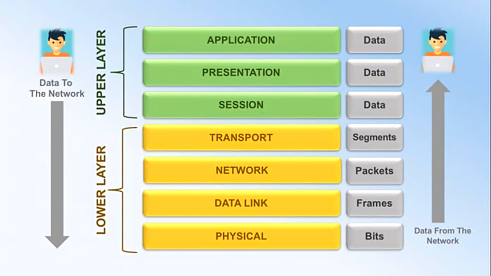
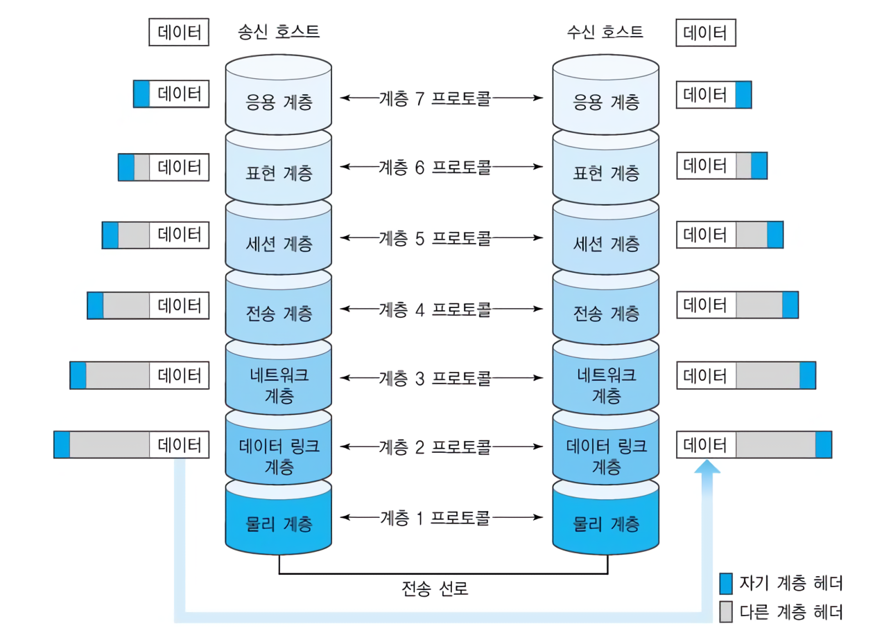
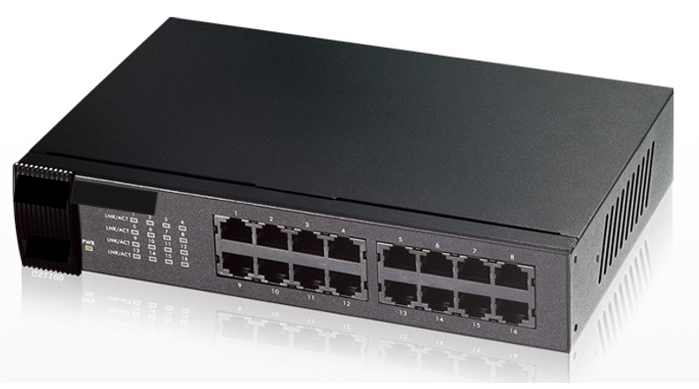
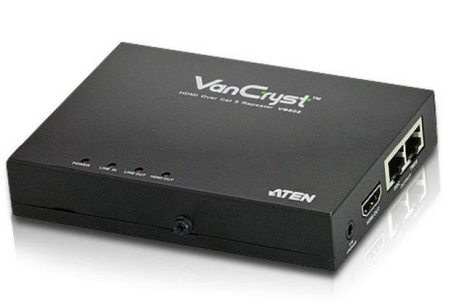
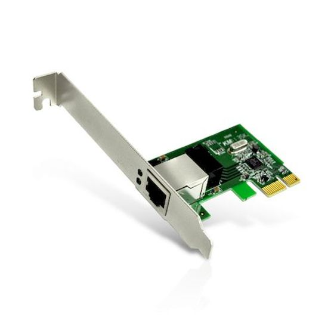
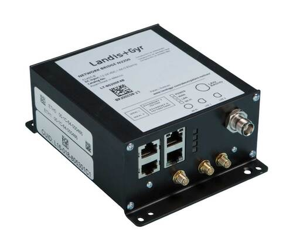
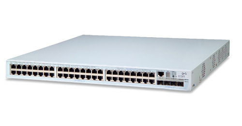
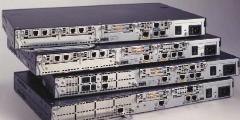
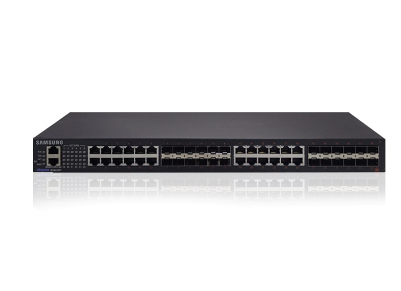
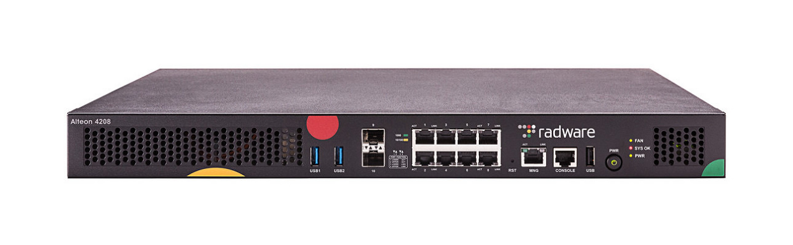

# 🌈 OSI 7 계층

## 📝 OSI 7 계층 개념

- Open Systems Interconnection Reference Model 7 Layer
- 개방형 시스템 상호연결 참조 모델 7계층

<br/>

|OSI 7 Layer 이미지|
|:---:|
||
||
||
||
||
||
||
||
||

<br/>

#### 주요 개념
- 국제 표준화 기구(ISO)에서 개발한 통신에 관한 계층화 표준 모델이다.
- 실제 인터넷에서 사용되는 TCP/IP 는 OSI 참조 모델을 기반으로 상업적이고 실무적으로 이용될 수 있도록 단순화한 것이다.

#### 의의
- 분산된 이기종 시스템간의 네트워크 상호호환을 위한 표준 아키텍처를 정의할수 있다.
- 통신에 관련된 목적을 달성하기 계층별로 분할하여 분업이 가능하다. (Divide and conquer)
- 기술표준인 기존 TCP 4계층 모델이 계층별로 역할이 불명확하여 발생했던 많은 문제들에 대한 해답을 제시한다.

#### 탄생배경
- 초기 여러 정보 통신 업체 장비들은 자신의 업체 장비들끼리만 연결이 되어 호환성이 없었다.
- 모든 시스템들의 상호 연결에 있어 문제없도록 표준을 정한것이 OSI 7계층이다.
- 표준(호환성)과 학습도구에 의미로 제작되었다.

#### 7 계층을 나누는 이유
- 통신이 일어나는 과정이 단계별로 파악할 수 있기 때문이다.
- 흐름을 한눈에 알아보기 쉽고, 사람들이 이해하기 쉽고, 7단계 중 특정한 곳에 이상이 생기면 다른 단계의 장비 및 소프트웨어를 건들이지 않고도 이상이 생긴 단계만 고칠 수 있기 때문이다.

<br/>

## 🪜 각 계층 별 설명

#### 1. Physical Layer (물리 계층)
- 물리적인 장치의 전기적, 전자적 연결에 대한 명세
- 디지털 데이터를 아날로그적인 전기적 신호로 변환하여 물리적인 전송이 가능케 한다.
- 주소 개념이 없으며 물리적으로 연결된 노드간에 신호를 주고 받는다.
- 단지 데이터 전기적인 신호로 변환해서 주고받는 기능을 진행하는 공간으로 데이터를 전송하는 역할만 진행한다.
- 주로 전기적, 기계적, 기능적인 특성을 이용해서 통신 케이블로 데이터를 전송하게 된다. 
- 이 계층에서 사용되는 통신 단위는 비트이며 이것은 1과 0으로 나타내어지는, 즉 전기적으로 On, Off 상태라고 생각하면 된다.

```markdown
- 단위(PDU) : 비트(Bit)
- 주요 프로토콜 : X.21, RS-232 등
- 주요 장비 : 허브(HUB), 리피터(Repeater) 네트워크 카드(NIC : Network Interface Card) 등
```

|허브|리피터|네트워크 카드|
|---|---|---|
||||

<br/>

#### 2. Data Link Layer (데이터 링크 계층)
- 인접한 노드간의 신뢰성 있는 데이터(단위 : 프레임) 전송을 제어(Nod-To-Nod Delivery)
- 네트워크 카드의 MAC(Media Access Control)주소를 통해 목적지를 찾아간다.
- 신뢰성 있는 전송을 위해 흐름제어(Flow Control), 오류제어(Error Control), 회선제어(Line Control)을 수행한다.
- 논리링크제어계층, 매체접근제어계층이라는 두 개의 부계층으로 나뉜다.
- 물리 계층으로 송수신되는 정보를 관리하여 안전하게 전달되도록 도와주는 역할을 한다.
- Mac 주소를 통해 통신한다. 프레임에 Mac 주소를 부여하고 오류검출, 재전송, 흐름제어를 진행한다.
- 주소 값은 물리적으로 할당 받는데, 이는 네트워크 카드가 만들어질 때부터 맥 주소(MAC address)가 정해져 있다는 뜻이다. 
- 주소 체계는 계층이 없는 단일 구조이다. 데이터 링크 계층의 가장 잘 알려진 예는 이더넷이다. 
- 이 외에도 HDLC나 ADCCP 같은 포인트 투 포인트(point-to-point) 프로토콜이나 패킷 스위칭 네트워크나 LLC, ALOHA 같은 근거리 네트워크용 프로토콜이 있다. 

```markdown
- 단위(PDU) : 프레임(Frame)
- 주요 프로토콜 : HDLC, X.25, Ethernet, TokenRing, DFFI, FrameRelay 등
- 주요 장비 : 브리지(Bridge), L2 Switch 등
```

|브리지|L2 Switch|
|---|---|
|||

<br/>

#### 3. Network Layer (네트워크 계층)
- 종단간 전송을 위한 경로 설정을 담당한다. (End-To-End 혹은 Host-To-Host Delivery)
- 호스트로 도달하기 위한 최적의 경로를 라우팅 알고리즘을 통해 선택하고 제어한다.
- 종단간 전송을 위한 주소로 IP주소를 사용한다.
- 데이터를 목적지까지 가장 안전하고 빠르게 전달하는 기능을 담당한다.
- 라우터를 통해 이동할 경로를 선택하여 IP 주소를 지정하고, 해당 경로에 따라 패킷을 전달해준다.
- 라우팅, 흐름 제어, 오류 제어, 세그먼테이션 등을 수행한다.
- 네트워크 계층(Network layer)은 여러개의 노드를 거칠때마다 경로를 찾아주는 역할을 하는 계층으로 다양한 길이의 데이터를 네트워크들을 통해 전달하고, 그 과정에서 전송 계층이 요구하는 서비스 품질(QoS)을 제공하기 위한 기능적, 절차적 수단을 제공한다.
- 데이터를 연결하는 다른 네트워크를 통해 전달함으로써 인터넷이 가능하게 만드는 계층이다. 
- 논리적인 주소 구조(IP), 곧 네트워크 관리자가 직접 주소를 할당하는 구조를 가지며, 계층적(hierarchical)이다.
- 서브네트의 최상위 계층으로 경로를 설정하고, 청구 정보를 관리한다. 개방형 시스템들의 사이에서 네트워크 연결을 설정, 유지, 해제하는 기능을 부여하고, 전송 계층 사이에 네트워크 서비스 데이터 유닛(NSDU : Network Service Data Unit)을 교환하는 기능을 제공한다.

```markdown
- 단위(PDU) : 패킷(Packet)
- 주요 프로토콜 - IP, ARP, ICMP, IGMP, RIP, RIP v2, OSPF, IGRP, EIGRP, BGP 등
- 주요 장비 : 라우터(Router), L3 Switch
```

|라우터|L3 Switch|
|---|---|
|||

<br/>

#### 4. Transport Layer (전송 계층)
- 종단간 신뢰성 있는 데이터 전송을 담당한다. (End-To-End Reliable Delivery)
- 종단(Host)의 구체적인 목적지(Process)까지 데이터가 도달할 수 있도록 한다. (Process-To-Process Communication)
- Process를 특정하기 위한 주소로 Port Number를 이용한다.
- 신뢰성 있는 데이터 전송을 위해 분할과 재조합, 연결제어, 흐름제어, 오류제어, 혼잡제어를 수행한다.
- TCP와 UDP 프로토콜을 통해 통신을 활성화한다. 포트를 열어두고, 프로그램들이 전송을 할 수 있도록 제공해준다.
    - TCP : 신뢰성, 연결지향적
    - UDP : 비신뢰성, 비연결성, 실시간
- 전송 계층(Transport layer)은 양 끝단(End to end)의 사용자들이 신뢰성있는 데이터를 주고 받을 수 있도록 해 주어, 상위 계층들이 데이터 전달의 유효성이나 효율성을 생각하지 않도록 해준다. 
- 시퀀스 넘버 기반의 오류 제어 방식을 사용한다. 
- 전송 계층은 특정 연결의 유효성을 제어하고, 일부 프로토콜은 상태 개념이 있고(stateful), 연결 기반(connection oriented)이다. 
- 이는 전송 계층이 패킷들의 전송이 유효한지 확인하고 전송 실패한 패킷들을 다시 전송한다는 것을 뜻한다. 

```markdown
- 단위(PDU) : 세그먼트(Segment)
- 주요 프로토콜 : TCP, UDP
- 주요 장비 : L4 Switch
```

|L4 Switch|
|---|
||

<br/>

#### 5. Session Layer (세션 계층)
- 응용 프로그램간의 논리적인 연결(세션) 생성 및 제어를 담당한다.
- 데이터가 통신하기 위한 논리적 연결을 담당한다. TCP/IP 세션을 만들고 없애는 책임을 지니고 있다.
- 통신을 하기위한 대문이라고 보면 된다. 
- 하지만 4계층에서도 연결을 맺고 종료할 수 있기 때문에 우리가 어느 계층에서 통신이 끊어 졌나 판단하기는 한계가 있다. 그러므로 세션 계층은 4 계층과 무관하게 응용 프로그램 관점에서 봐야 한다. 
- 세션 설정, 유지, 종료, 전송 중단시 복구 등의 기능이 있다.
- 세션 계층(Session layer)은 양 끝단의 응용 프로세스가 통신을 관리하기 위한 방법을 제공한다. 
- 동시 송수신 방식(duplex), 반이중 방식(half-duplex), 전이중 방식(Full Duplex)의 통신과 함께, 체크 포인팅과 유휴, 종료, 다시 시작 과정 등을 수행한다. 
- 이 계층은 TCP/IP 세션을 만들고 없애는 책임을 진다.
- 통신하는 사용자들을 동기화하고 오류복구 명령들을 일괄적으로 다룬다. 
- 통신을 하기 위한 세션을 확립/유지/중단 (운영체제가 해줌)

```markdown
- 단위(PDU) : 데이터(Data) 또는 메세지(Message)
- 주요 프로토콜 : 해당사항 없음
- 주요 장비 : 해당사항 없음
```

<br/>

#### 6. Presentation Layer (표현 계층)
- 데이터 표현방식, 상이한 부호체계 간의 변화에 대해 규정한다.
- 인코딩/디코딩, 압축/해제, 암호화/복호화 등의 역할을 수행한다.
- 데이터 표현에 대한 독립성을 제공하고 암호화하는 역할을 담당한다.
- 표현 계층(Presentation layer)은 코드 간의 번역을 담당하여 사용자 시스템에서 데이터의 형식상 차이를 다루는 부담을 응용 계층으로부터 덜어 준다. MIME 인코딩이나 암호화 등의 동작이 이 계층에서 이루어진다. 
- 예를 들면, EBCDIC로 인코딩된 문서 파일을 ASCII로 인코딩된 파일로 바꿔 준다.
- 해당 데이터가 TEXT인지, 그림인지, GIF인지 JPG인지의 구분 등이 표현 계층의 몫이다.

```markdown
- 단위(PDU) : 데이터(Data)
- 주요 프로토콜 : 해당사항 없음
- 주요 장비 : 해당사항 없음
```

<br/>

#### 7. Application Layer (응용 계층)
- 최종 목적지로, 응용 프로세스와 직접 관계하여 일반적인 응용 서비스를 수행한다.
- 사용자 인터페이스, 전자우편, 데이터베이스 관리 등의 서비스를 제공한다.
- HTTP, FTP, SMTP, POP3, IMAP, Telnet 등과 같은 프로토콜이 있다. 
- 해당 통신 패킷들은 방금 나열한 프로토콜에 의해 모두 처리되며 우리가 사용하는 브라우저나, 메일 프로그램은 프로토콜을 보다 쉽게 사용하게 해주는 응용프로그램이다. 한마디로 모든 통신의 양 끝단은 HTTP와 같은 프로토콜이지 응용프로그램이 아니다.
- 응용 계층(Application layer)은 응용 프로세스와 직접 관계하여 일반적인 응용 서비스를 수행한다. 
- 일반적인 응용 서비스는 관련된 응용 프로세스들 사이의 전환을 제공한다. 
- 예를 들어, 가상 터미널(예를 들어, 텔넷), "Job transfer and Manipulation protocol" (JTM, 표준 ISO/IEC 8832) 등이 있다.
- 네트워크 소프트웨어 UI 부분, 사용자의 입출력(I/O)부분을 응용 계층이라고 볼 수 있다.

```markdown
- 단위(PDU) : 데이터(Data)
- 주요 프로토콜 : TELNET, FTP, SMTP, HTTP 등
- 주요 장비 : 해당사항 없음
```

<br/>

## 🎤 면접 질문

- OSI 7계층을 설명하시오

```markdown
- OSI 7계층이란, 통신 접속에서 완료까지의 과정을 7단계로 정의한 국제 통신 표준 규약이다.

- 7계층 간단 설명
    - 물리 : 전송하는데 필요한 기능을 제공 (통신 케이블, 허브)
    - 데이터링크 : 송/수신 확인. MAC 주소를 가지고 통신함 (브릿지, 스위치)
    - 네트워크 : 패킷을 네트워크 간의 IP를 통해 데이터 전달 (라우팅)
    - 전송 : 두 host 시스템으로부터 발생하는 데이터 흐름 제공
    - 세션 : 통신 시스템 사용자간의 연결을 유지 및 설정함
    - 표현 : 세션 계층 간의 주고받는 인터페이스를 일관성있게 제공
    - 응용 : 사용자가 네트워크에 접근할 수 있도록 서비스 제공
```

<br/>

## 👍 참조사이트

- https://itwiki.kr/w/OSI_7%EA%B3%84%EC%B8%B5
- https://velog.io/@cgotjh/%EB%84%A4%ED%8A%B8%EC%9B%8C%ED%81%AC-OSI-7-%EA%B3%84%EC%B8%B5-OSI-7-LAYER-%EA%B8%B0%EB%B3%B8-%EA%B0%9C%EB%85%90-%EA%B0%81-%EA%B3%84%EC%B8%B5-%EC%84%A4%EB%AA%85
- https://gyoogle.dev/blog/computer-science/network/OSI%207%EA%B3%84%EC%B8%B5.html
- https://blog.naver.com/PostView.nhn?isHttpsRedirect=true&blogId=pst8627&logNo=221670903384
- http://wiki.hash.kr/index.php/%EB%8C%80%EB%AC%B8
- https://www.landisgyr.ca/product/network-bridge/
- https://namu.wiki/w/%EB%84%A4%ED%8A%B8%EC%9B%8C%ED%81%AC%20%EC%B9%B4%EB%93%9C?rev=51
- https://the-cloud.tistory.com/39