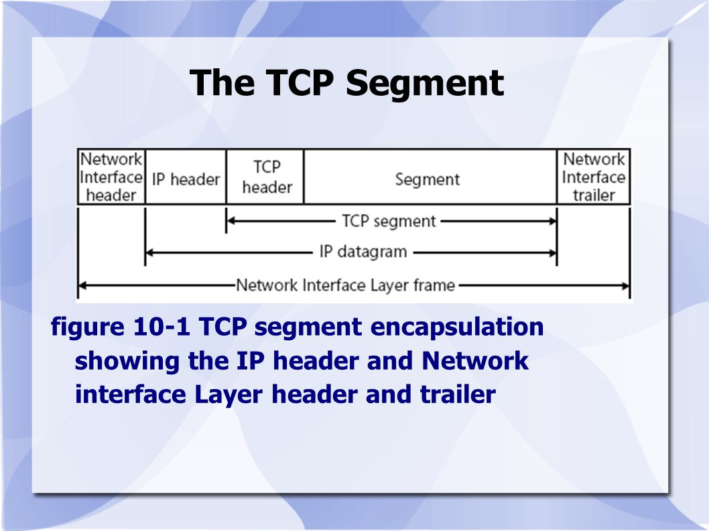
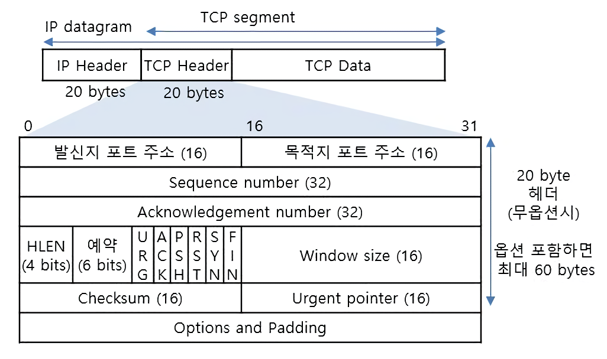
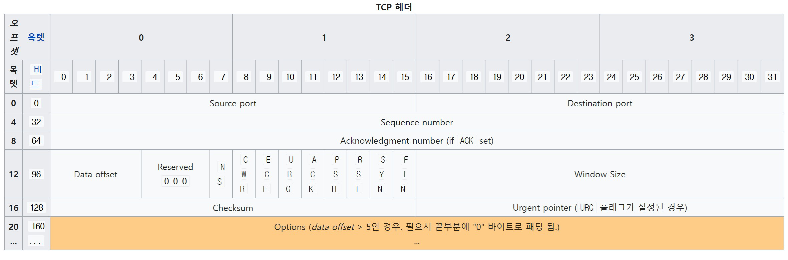
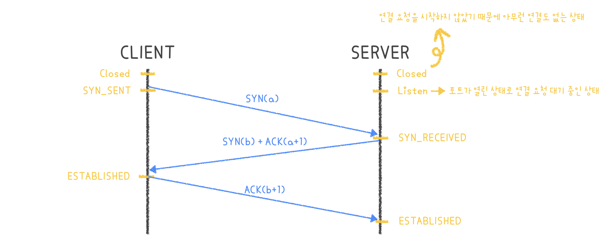
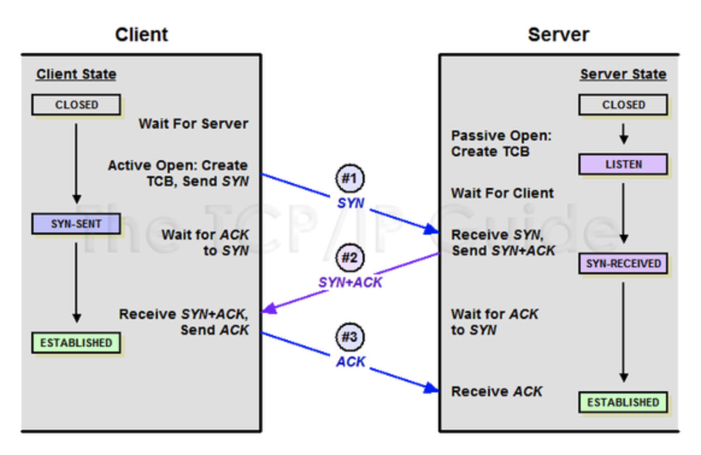
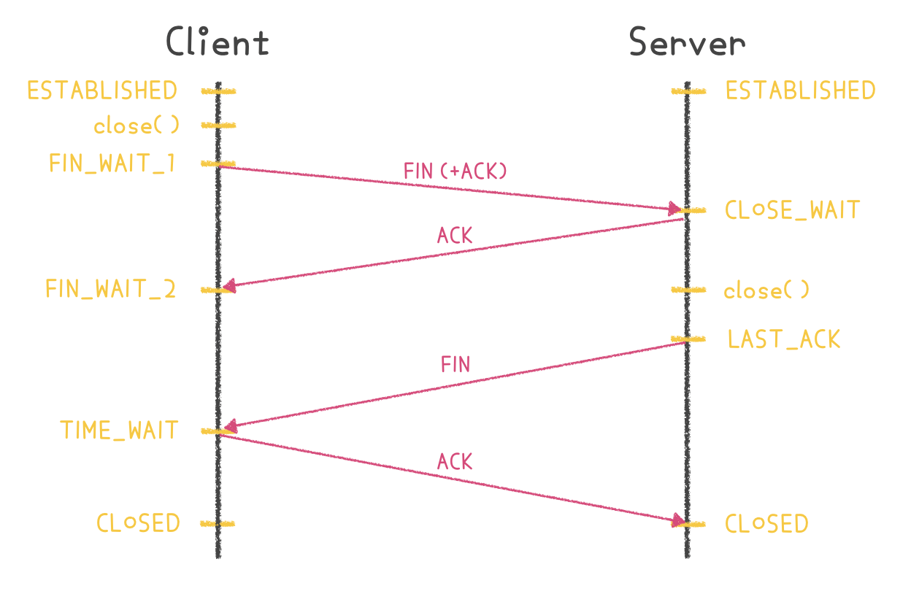
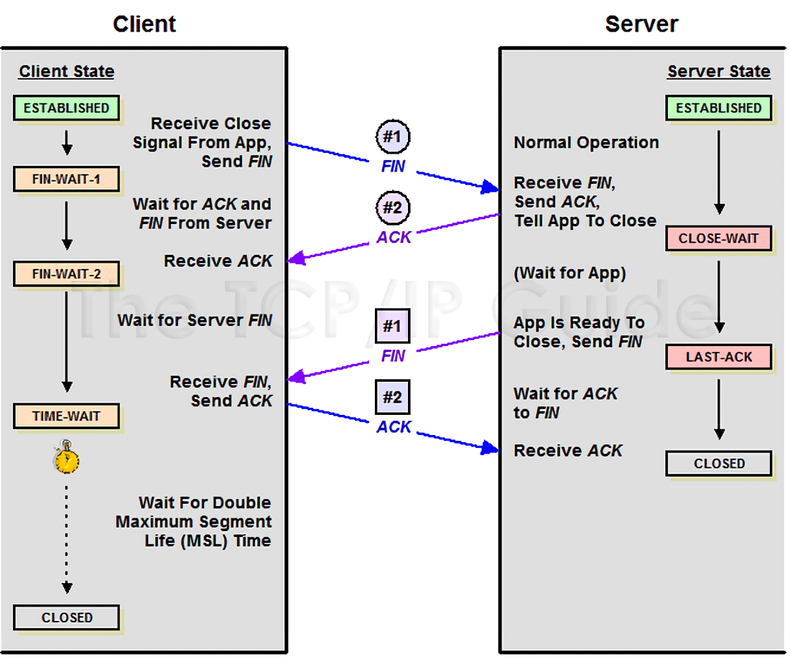

# TCP

## TCP 개념
- Transmission Control Protocol
- 양종단 호스트 내 프로세스 상호 간에 신뢰적인 연결지향성 서비스를 제공하는 전송 계층 프로토콜
- TCP(티씨피)는 "Transmission Control Protocol"의 약자로서, 인터넷에서 사용되는 표준 통신 프로토콜이다. 한국어로 번역하면, 전송 제어 프로토콜이라는 뜻이다. 흔히 TCP와 IP를 결합하여, TCP/IP라고 사용한다. 
- 전송 계층(Transport Layer)에서 사용되는 프로토콜로는 대표적으로 TCP와 UDP가 있다.
  - TCP가 1:1 연결을 통해 안전하게 데이터 를 교환하는 것과 달리, UDP는 1:N 방식으로 한쪽에서 다른 쪽으로 일방적으로 데이터를 전송한다. TCP가 전화와 비슷하다면, UDP는 일방적으로 보내는 소포와 비슷하다.
  - 비교적 간단하고 빠른 UDP에 비해 TCP는 더 복잡하고 느리지만, 보다 신뢰성있는 연결이 가능해진다.
  - TCP와 UDP는 포트 번호를 이용하여 주소를 지정하는것과 데이터 오류검사를 위한 체크섬 존재하는 두가지 공통점을 가지고 있지만 정확성(TCP)을 추구할지 신속성(UDP)을 추구할지를 구분하여 나뉜다.

- 참고**
  - 전송 계층은 송신자와 수신자를 연결하는 통신 서비스를 제공하고 IP에 의해 전달되는 패킷의 오류를 검사하며 재전송 요구 제어등을 담당하는 계층이다.
  - 다시말해 데이터의 전달을 담당한다.

<br/>

## TCP 특징
- 신뢰성 있는 연결을 지향한다.
- 세그먼트에 순번을 지정하여 데이터의 순서를 유지한다.
- 3-Way Handshaking을 통해 연결하고 4-Way Handshaking을 통해 연결을 종료한다.

<br/>

## TCP 세그먼트
||
|:---:|

- TCP 세그먼트는 TCP로 연결된 세션간의 전달되는 데이터 단위
- TCP는 데이터 스트림으로부터 데이터를 받아 들여 이것을 일정 단위로 분할한 뒤 TCP 헤더를 덧붙여 TCP 세그먼트를 생성한다. TCP 세그먼트는 *IP 데이터그램에 캡슐화되어 상대방과 주고 받게 된다.
  ```
  TCP 세그먼트 =  세그먼트 헤더(TCP 헤더) + 데이터
  ```
  ```
  TCP 페이로드 세그먼트 크기 =  (IP헤더의 Total Length) - (IP 헤더의 Header Length) - (TCP헤더의 Header Length)
  ```

<br/>

## TCP 헤더
||
|:---:|

||
|:---:|

- Source Port (16 비트) : 출발지 포트번호이다. 즉, 송신 포트를 의미한다.
- Destination Port (16 비트) : 목적지 포트번호이다. 즉, 수신 포트를 의미한다.
- Sequence Number (32 비트) : 바이트 단위로 순서화되는 번호로, 이것을 통해 신뢰성(3-Way Handshake) 및 흐름제어(sliding Window) 기능을 제공한다.
- Acknowledgment Number (32 비트) : 수신하기를 기대하는 다음 byte 번호를 의미한다. (마지막으로 수신에 성공한 번호의 +1)
- Data Offset(HLEN) (4 비트): 헤더 길이 필드이며 IPv4와 마찬가지로 나누기 4 계산 후 2진수로 작성된다.
- Reserved (3 비트): 예약된 필드이다. 현재 사용되지 않는다.
- Flags(TCP 제어 플래그) (9 비트) : 현재 세그먼트의 속성을 나타낸다. 기존에는 6개의 플래그만을 사용했지만, 혼잡 제어 기능의 향상을 위해 Reserved 필드를 사용하여 NS, CWR, ECE 플래그가 추가되었다.
    |필드|의미|
    |---|---|
    |URG|Urgent Pointer(긴급 포인터) 필드에 값이 채워져있음을 알리는 플래그. 이 포인터가 가리키는 긴급한 데이터는 높게 처리되어 먼저 처리된다. 요즘에는 많이 사용되지 않는다.|
    |ACK|Acknowledgment(승인 번호) 필드에 값이 채워져있음을 알리는 플래그. 이 플래그가 0이라면 승인 번호 필드 자체가 무시된다.|
    |PSH|Push 플래그. 수신 측에게 이 데이터를 최대한 빠르게 응용프로그램에게 전달해달라는 플래그이다. 이 플래그가 0이라면 수신 측은 자신의 버퍼가 다 채워질 때까지 기다린다. 즉, 이 플래그가 1이라면 이 세그먼트 이후에 더 이상 연결된 세그먼트가 없음을 의미하기도 한다.|
    |RST|Reset 플래그. 이미 연결이 확립되어 ESTABLISHED 상태인 상대방에게 연결을 강제로 리셋해달라는 요청의 의미이다.|
    |SYN|Synchronize 플래그. 상대방과 연결을 생성할 때, 시퀀스 번호의 동기화를 맞추기 위한 세그먼트임을 의미한다.|
    |FIN|Finish 플래그. 상대방과 연결을 종료하고 싶다는 요청인 세그먼트임을 의미한다.|
    |||
    |NS|ECN에서 사용하는 CWR, ECE 필드가 실수나 악의적으로 은폐되는 경우를 방어하기 위해 RFC 3540에서 추가된 필드이다.|
    |ECE|ECN Echo 플래그. 해당 필드가 1이면서, SYN 플래그가 1일 때는 ECN을 사용한다고 상대방에게 알리는 의미. SYN 플래그가 0이라면 네트워크가 혼잡하니 세그먼트 윈도우의 크기를 줄여달라는 요청의 의미이다.|
    |CWR|이미 ECE 플래그를 받아서, 전송하는 세그먼트 윈도우의 크기를 줄였다는 의미이다.|

- Window size : 자신의 수신 버퍼 여유 용량 크기를 통보하여 얼마만큼의 데이터를 받을 수 있는지 상대방에게 알려주어 흐름제어를 수행하게 되는 필드이다.
- Checksum : 헤더 및 데이터의 에러 확인을 위해 사용되는 필드이다.
- Urgent Pointer : 어디서부터 긴급 값인지 알려주는 플래그이다. (TCP Flags의 U와 세트)
- Options : 옵션 필드는 TCP의 기능을 확장할 때 사용하는 필드로, 크기가 고정된 것이 아니라 가변적이다.
- Padding : TCP 헤더의 종료 지점과 데이터의 시작 지점을 32 비트 단위 길이에 맞추기 위해 사용한다.

<br/>

## 3 way handshake 
||
|:---:|

||
|:---:|

||
|:---:|

- TCP 통신을 이용하여 데이터를 전송하기 위해 네트워크 연결을 설정(Connection Establish) 하는 과정이다.
- TCP는 정확한 전송을 보장해야 한다. 따라서 통신하기에 앞서, 논리적인 접속을 성립하기 위해 3 way handshake 과정을 진행한다.
- 간단히 표현하면 다음과 같다
  
  ```
  1) Client -> Server : 내 말 들려?
  2) Server -> Client : 잘 들려. 내 말은 들려?
  3) Client -> Server : 잘 들려!
  ```


#### Step 1. Client --(SYN)--> Server
- Client에서 Server에게 SYN를 보낸다. 이 때 Client의 상태는 SYN을 보냈다는 SYN_SENT 상태로 바뀐다.
- Client가 최초로 데이터를 전송할 때 Sequence Number를 임의의 랜덤 숫자로 지정하고, SYN 플래그 비트를 1로 설정한 세그먼트를 전송한다.
- PORT 상태 
  - Client : CLOSED -> (SYN 보낸 후) -> SYN_SENT
  - Server : LISTEN

#### Step 2. Server --(SYN + ACK)--> Client
- Server에서는 SYN을 받았다는 SYN_RECEIVED 상태로 바뀐후 Client에게 잘 받았다는 응답의 ACK과 SYN를 보낸다.
- Server는 Acknowledgement Number 필드를 (Sequence Number + 1)로 지정하고, SYN과 ACK 플래그 비트를 1로 설정한 세그먼트를 전송한다.
- PORT 상태 
  - Client : SYN_SENT
  - Server : LISTEN -> (SYN + ACK 보낸 후) -> SYN_RECEIVED

#### Step 3. Client --(ACK)--> Server
- Client에서는 상호 연결이 된 상태의 ESTABLISHED로 바뀐다. 그후 Server에게 ACK을 보낸다. Server에서는 ACK를 받은 후에 ESTABLISHED 상태로 바뀌게된다.
- 이때, 전송할 데이터가 있으면 이 단계에서 데이터를 전송할 수 있다.
- PORT 상태
  - Client : SYN_SENT -> (SYN + ACK 받은 후) -> ESTABLISHED
  - Server : SYN_RECEIVED -> (ACK 받은 후) -> ESTABLISHED

<br/>

## 4 way handshake
||
|:---:|

||
|:---:|

||
|:---:|

- TCP의 연결을 해제(Connection Termination) 하는 과정이다.
- 연결 성립 후, 모든 통신이 끝났다면 해제해야 한다.
- 간단히 표현하면 다음과 같다
  
  ```
  1) Client -> Server : 나는 다 보냈어. 이제 끊자!
  2) Server -> Client : 알겠어! 잠시만~
  3) Server -> Client : 나도 끊을게!
  4) Client -> Server : 알겠어!
  ```

#### Step 1. Client --(FIN)--> Server
- Server와 Client가 TCP 연결이 되어있는 상태에서 Client가 접속을 끊기 위해 close( )를 호출한다. 
- Client가 close( )를 호출하면서 Server에게 FIN 패킷을 보내게 되는데, 이때 FIN 패킷에 실질적으로는 ACK도 포함되어 있다. 
- 그후 Client는 FIN_WAIT_1 상태로 들어간다.
- PORT 상태
  - Client : ESTABLISHED -> (FIN 보낸 후) -> FIN_WAIT_1
  - Server : ESTABLISHED

#### Step 2. Server --(ACK)--> Client
- Server는 Client에게 응답 ACK를 보내고 CLOSE_WAIT 상태에 들어간다.
- 그후 아직 남은 데이터가 있다면 마저 전송을 마친 후에 close( )를 호출한다.
- Server는 Acknowledgement Number 필드를 (Sequence Number + 1)로 지정하고, ACK 플래그 비트를 1로 설정한 세그먼트를 전송한다.
- Client에서는 서버에서 ACK를 받은 후에 Server가 남은 데이터 처리를 끝내고 FIN 패킷을 보낼 때까지 기다리게 된다.
- PORT 상태
  - Client : FIN_WAIT_1 (ACK 받은 후) -> FIN_WAIT_2
  - Server : ESTABLISHED -> (ACK 보낸 후) -> CLOSE_WAIT

#### Step 3. Server --(FIN)--> Client
- Server는 이제 모든 데이터 처리가 끝났다고 종료에 합의 한다는 뜻으로 Client에게 FIN 패킷을 보낸 후에 승인 번호를 보내줄 때까지 기다리는 LAST_ACK 상태로 들어간다.
- PORT 상태
  - Client : FIN_WAIT_2
  - Server : CLOSE_WAIT -> (FIN 보낸 후) -> LAST_ACK

#### Step 4. Client --(ACK)--> Server
- Client는 Server에서 FIN 패킷을 받고 나서 다시 Server에게 ACK 응답을 보낸 후에 TIME_WAIT 상태로 들어가며 실질적인 종료 과정(CLOSED)에 들어가게 된다. 
- 이때 TIME_WAIT 상태는 의도치 않은 에러로 인해 연결이 데드락으로 빠지는 것을 방지하는데, 만약 에러로 인해 종료가 지연되다가 타임이 초과되면 CLOSED로 들어간다.
- Server는 ACK를 받고 CLOSED 상태로 들어가 종료하게 된다.
- PORT 상태
  - Client : FIN_WAIT_2 (ACK 보낸 후) -> TIME_WAIT -> CLOSED
  - Server : LAST_ACK -> (ACK 받은 후) -> CLOSED

<br/>

## 🎤 면접 질문

- 3-way handshaking를 설명하시오

```markdown
TCP 소켓은 연결 설정과정 중에 총 3번의 대화를 주고 받는다.

(SYN : 연결 요청 플래그 / ACK : 응답)

    - 클라이언트는 서버에 접속 요청하는 SYN(M) 패킷을 보냄
    - 서버는 클라이언트 요청인 SYN(M)을 받고, 클라이언트에게 요청을 수락한다는 ACK(M+1)와 SYN(N)이 설정된 패킷을 발송함
    - 클라이언트는 서버의 수락 응답인 ACK(M+1)와 SYN(N) 패킷을 받고, ACK(N+1)를 서버로 보내면 연결이 성립됨
    - 클라이언트가 연결 종료하겠다는 FIN 플래그를 전송함
    - 서버는 클라이언트의 요청(FIN)을 받고, 알겠다는 확인 메시지로 ACK를 보냄. 그 이후 데이터를 모두 보낼 때까지 잠깐 TIME_OUT이 됨
    - 데이터를 모두 보내고 통신이 끝났으면 연결이 종료되었다고 클라이언트에게 FIN플래그를 전송함
    - 클라이언트는 FIN 메시지를 확인했다는 ACK를 보냄
    - 클라이언트의 ACK 메시지를 받은 서버는 소켓 연결을 close함
    - 클라이언트는 아직 서버로부터 받지 못한 데이터가 있을 것을 대비해서, 일정 시간동안 세션을 남겨놓고 잉여 패킷을 기다리는 과정을 거침 ( TIME_WAIT )
```

<br/>

## 👍 참조사이트
- https://itwiki.kr/w/TCP
- https://itwiki.kr/w/TCP_%EC%A0%9C%EC%96%B4_%ED%94%8C%EB%9E%98%EA%B7%B8
- https://ko.wikipedia.org/wiki/%EC%A0%84%EC%86%A1_%EC%A0%9C%EC%96%B4_%ED%94%84%EB%A1%9C%ED%86%A0%EC%BD%9C
- http://wiki.hash.kr/index.php/TCP
- https://evan-moon.github.io/2019/11/10/header-of-tcp/
- https://gyoogle.dev/blog/computer-science/network/TCP%203%20way%20handshake%20&%204%20way%20handshake.html
- https://m.blog.naver.com/PostView.naver?isHttpsRedirect=true&blogId=4717010&logNo=60212483299
- https://dany-it.tistory.com/331
- https://lucidmaj7.tistory.com/119
- https://nogan.tistory.com/20
- https://beenii.tistory.com/127
- https://gmlwjd9405.github.io/2018/09/19/tcp-connection.html
- https://seongonion.tistory.com/74
- https://mindnet.tistory.com/entry/%EB%84%A4%ED%8A%B8%EC%9B%8C%ED%81%AC-%EC%89%BD%EA%B2%8C-%EC%9D%B4%ED%95%B4%ED%95%98%EA%B8%B0-22%ED%8E%B8-TCP-3-WayHandshake-4-WayHandshake
