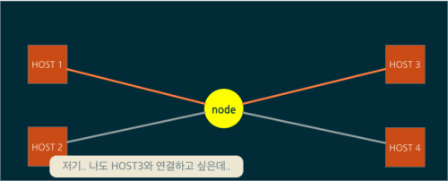
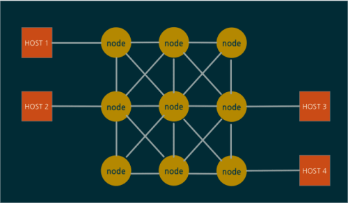
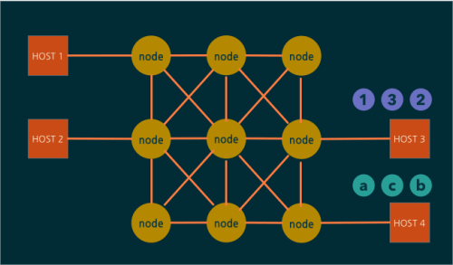

# TCP/IP

## 데이터 통신의 발전

#### 서킷 통신
- 처음 인터넷이 생기기전까지 통신을 하기 위해서는 양쪽에서의 연결이 필요했다.
- 연결이 이루어지게 되면 연결이 끊어질 때까지 해당 회선을 독점하여 사용한다.
- 통신을 하려고하는 양쪽이 1대1로 연결되어야 하며, 양쪽이 직접적으로 연결되거나 중간 교환소를 통해 연결되었다.


- 하지만 연결중에는 해당 회선을 완전히 점유하기 때문에 다른 연결이 불가능했다.
- 다른 연결을 위해서는 이미 연결된 곳이 끊어질 때까지 기다려야 했다.


#### 여러개의 노드로 망 다중화
- 서킷 통신을 해결하기 위해서는 망을 여러개 만들면 된다.
- 망을 여러개 만든 경우 중간에 연결이 끊어지더라도 다시 연결할 수 있다.
- 하지만 중간에 연결이 끊어지는 경우 다시 연결을 해야하며, 연결 가능한 망을 찾아 다시 연결해야하기 때문에 효율적이지 않다.


#### 패킷통신
- 데이터를 작게 잘라 보낸다.
- 작게 잘린 데이터 조각들이 각각 목적지로 향하기 때문에 효율적이다.
- 하지만 작게 나누어 보내면 순서가 뒤섞이거나 누락되는 데이터가 발생할 수 있다.


- 따라서 패킷 통신 이후 데이터를 받은 곳에서 점검을 해서 순서를 정렬하거나 빠진 내용을 다시 받으면 된다. 


## TCP/IP 개념
- 인터넷 프로토콜 스위트(영어: Internet Protocol Suite)는 인터넷에서 컴퓨터들이 서로 정보를 주고받는 데 쓰이는 통신규약(프로토콜)의 모음이다. 인터넷 프로토콜 슈트 중 TCP와 IP가 가장 많이 쓰이기 때문에 TCP/IP 프로토콜 슈트라고도 불린다.
- TCP/IP는 패킷 통신 방식의 인터넷 프로토콜인 IP (인터넷 프로토콜)와 전송 조절 프로토콜인 TCP (전송 제어 프로토콜)로 이루어져 있다. 
- IP는 패킷 전달 여부를 보증하지 않고, 패킷을 보낸 순서와 받는 순서가 다를 수 있다.(unreliable datagram service) TCP는 IP 위에서 동작하는 프로토콜로, 데이터의 전달을 보증하고 보낸 순서대로 받게 해준다. 
  - IP는 복잡한 네트워크 망에서 효율적으로 데이터를 보낸다. 즉, 데이터를 작은 조각으로 빨리 보내는 것이 중요
  - TCP는 IP가 작게 잘라 보낸 데이터의 순서와 누락된 데이터를 점검하여 다시 요청한다.
- HTTP, FTP, SMTP 등 TCP를 기반으로 한 많은 수의 애플리케이션 프로토콜들이 IP 위에서 동작하기 때문에, 묶어서 TCP/IP로 부르기도 한다.
    - HTTP, FTP, SMTP 등은 웹이나 여러 데이터를 주고 받기 위한 프로토콜이다.


<br/>


## TCP/IP 프로토콜 4계층

#### 1. LINK Layer (Network Access Layer (네트워크 엑세스 계층) )

<br/>

#### 2. IP Layer (Internet Layer (인터넷 계층) )

<br/>

#### 3. TCP/UDP Layer (Transport Layer (전송 계층))

<br/>

#### 4. Application Layer (응용 계층)


<br/>


## TCP/IP Server와 Client 통신 구조


<br/>


## TCP/IP 특징

#### 흐름제어
- 수신측이 송신측보다 데이터 처리 속도가 빠르면 문제없지만, 송신측의 속도가 빠를 경우 문제가 생긴다.
- 수신측에서 제한된 저장 용량을 초과한 이후에 도착하는 데이터는 손실 될 수 있으며, 만약 손실 된다면 불필요하게 응답과 데이터 전송이 송/수신 측 간에 빈번이 발생한다.
- 이러한 위험을 줄이기 위해 송신 측의 데이터 전송량을 수신측에 따라 조절해야한다.
  
##### 1. Stop and Wait

##### 2. 슬라이딩 윈도우(Go Back N APQ)

<br/>

#### 혼잡제어
- 송신측의 데이터는 지역망이나 인터넷으로 연결된 대형 네트워크를 통해 전달된다. 만약 한 라우터에 데이터가 몰릴 경우, 자신에게 온 데이터를 모두 처리할 수 없게 된다. 이런 경우 호스트들은 또 다시 재전송을 하게되고 결국 혼잡만 가중시켜 오버플로우나 데이터 손신을 발생시키게 된다. 따라서 이러한 네트워크의 혼잡을 피하기 우해 송신측에서 보내는 데이터의 전송속도를 강제로 줄이게 되는데, 이러한 작업을 혼잡제어라고 한다.
- 또한 네트워크 내에 패킷의 수가 과도하게 증가하는 현상을 혼잡이라 하며, 혼잡 현상을 방지하거나 제거하는 기능을 혼잡제어라고 한다.
- 흐름제어가 송신측과 수신측 사이의 전송속도를 다루는데 반해, 혼잡제어는 호스트와 라우터를포함한 보다 넓은 관점에서 전송 문제를 다루게 된다.

##### 1. AIMD (Additive Increase / Multiplicative Decrease)

##### 2. Slow Start

##### 3. Fast Retransmit


<br/>


## 🎤 면접 질문

- TCP/IP 프로토콜을 스택 4계층으로 짓고 설명하시오

```markdown
# LINK 계층
- 물리적인 영역의 표준화에 대한 결과
- 가장 기본이 되는 영역으로 LAN, WAN과 같은 네트워크 표준과 관련된 프로토콜을 정의하는 영역이다

# IP 계층
- 경로 검색을 해주는 계층임
- IP 자체는 비연결지향적이며, 신뢰할 수 없는 프로토콜이다
- 데이터를 전송할 때마다 거쳐야할 경로를 선택해주지만, 경로가 일정하지 않음. 또한 데이터 전송 중에 경로상 문제가 발생할 때 데이터가 손실되거나 오류가 발생하는 문제가 발생할 수 있음. 따라서 IP 계층은 오류 발생에 대한 대비가 되어있지 않은 프로토콜임

# TCP/UDP (전송) 계층
- 데이터의 실제 송수신을 담당함
- UDP는 TCP에 비해 상대적으로 간단하고, TCP는 신뢰성잇는 데이터 전송을 담당함
- TCP는 데이터 전송 시, IP 프로토콜이 기반임 (IP는 문제 해결에 문제가 있는데 TCP가 신뢰라고?)
- → IP의 문제를 해결해주는 것이 TCP인 것. 데이터의 순서가 올바르게 전송 갔는지 확인해주며 대화를 주고받는 방식임. 이처럼 확인 절차를 걸치며 신뢰성 없는 IP에 신뢰성을 부여한 프로토콜이 TCP이다

# 애플리케이션 계층
- 서버와 클라이언트를 만드는 과정에서 프로그램 성격에 따라 데이터 송수신에 대한 약속들이 정해지는데, 이것이 바로 애플리케이션 계층이다
```

- TCP/IP의 서버와 클라이언트의 함수 호출 순서와 그 차이를 설명하시오

```markdown
# 함수 호출 순서
- 서버 : socket() 생성 → bind() 소켓 주소할당 → listen() 연결요청 대기상태 → accept() 연결허용 → read/write() 데이터 송수신 → close() 연결종료
- 클라이언트 : socket() 생성 → connect() 연결요청 → read/write() 데이터 송수신 → close() 연결종료

# 둘의 차이는?
- 클라이언트 소켓을 생성한 후, 서버로 연결을 요청하는 과정에서 차이가 존재한다.
- 서버는 listen() 호출 이후부터 연결요청 대기 큐를 만들어 놓고, 그 이후에 클라이언트가 연결 요청을 할 수 있다. 이때 서버가 바로 accept()를 호출할 수 있는데, 연결되기 전까지 호출된 위치에서 블로킹 상태에 놓이게 된다.
```

- TCP/IP의 특징인 흐름제어와 혼잡제어를 간단히 설명하시오

```markdown
흐름제어 : 송신 측과 수신 측의 데이터 처리 속도 차이를 조절해주는 것
혼잡제어 : 네트워크 내의 패킷 수가 넘치게 증가하지 않도록 방지하는 것
```


<br/>

## 👍 참조사이트
- https://brunch.co.kr/@wangho/6
- https://aws-hyoh.tistory.com/entry/TCPIP-%EC%89%BD%EA%B2%8C-%EC%9D%B4%ED%95%B4%ED%95%98%EA%B8%B0
- https://gyoogle.dev/blog/computer-science/network/%ED%9D%90%EB%A6%84%EC%A0%9C%EC%96%B4%20&%20%ED%98%BC%EC%9E%A1%EC%A0%9C%EC%96%B4.html
- https://ko.wikipedia.org/wiki/%EC%9D%B8%ED%84%B0%EB%84%B7_%ED%94%84%EB%A1%9C%ED%86%A0%EC%BD%9C_%EC%8A%A4%EC%9C%84%ED%8A%B8

## 이미지 출처
- 데이터 통신 그림 : 낭만기획 블로그(https://brunch.co.kr/@wangho/6)